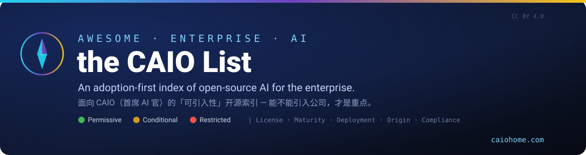
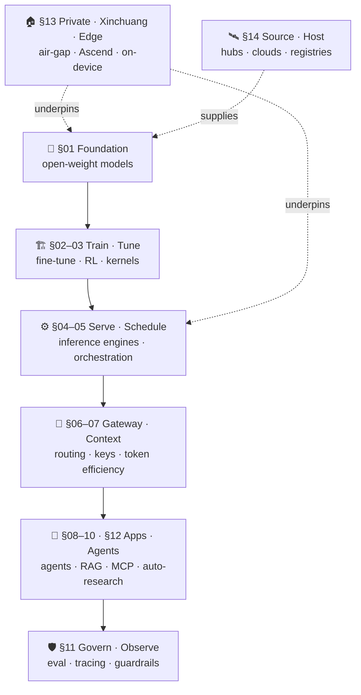

# 🧭 Awesome Enterprise AI — the CAIO List

**An adoption-first index of open-source AI for the enterprise — curated through the eyes of a CAIO.**

*面向 CAIO（首席 AI 官 / AI 负责人）的「可引入性」开源索引。*
*Not the coolest projects — the ones you can actually bring into a company.*

[🌐 caiohome.com](https://www.caiohome.com) · [🏷️ Legend](#legend) · [🧱 Starter Stack](#reference-starter-stack) · [🗺️ Decision Chain](#the-caio-decision-chain) · [🗂️ Contents](#contents) · [🤝 Contribute](CONTRIBUTING.md)

---

> **The one question this list answers:**
> *"Can this open-source project be brought into my company — to which layer, used by whom, under what license, and at how much compliance risk?"*
>
> 本清单只回答一件事：**「这个开源项目能不能引入公司、引入到哪一层、谁来用、什么许可证、合规风险多大」**。
> Maintained by **CAIO之家 · [caiohome.com](https://www.caiohome.com)** — the home for Chief AI Officers.

Every other `awesome` list organizes by *technical category* or *research topic*, serving engineers and researchers. This one flips the axis: it is organized by the **CAIO adoption decision chain**, and every entry carries a set of **enterprise metadata tags** and a **direct link to its source**. Anyone can copy the entries — nobody can copy the *judgment*. That judgment is the only reason this list exists.

<b>📖 Why another list? · 为什么再做一个清单</b>

 

Awesome-LLM, Awesome-LLMOps, awesome-mcp-servers and friends are excellent — but they answer *"what exists?"*. A CAIO needs to answer *"what can I safely ship, and what will legal/security say?"* The market is full of 50k-star projects that no enterprise can touch (wrong license, no air-gap, single-vendor lock-in), and 800-star projects that are perfect to adopt.

So here the organizing principle is the **introduction decision** itself. A `🔴`-license 50k-star repo can be worth *less* to your company than a `🟢`-license 800-star one. Stars are not an inclusion criterion.

市面上的 awesome 清单按技术类别组织，服务工程师与研究者。本清单换一根轴 —— 按 **CAIO 的引入决策链** 分层，并要求每个条目挂一套企业元数据 + 一个可点击的源头链接。抄条目容易，抄不走这套「引入判断」。

---

## Legend

> Tags are **decision aids, not endorsements.** Final adoption rests with your legal, compliance, and security review.
> 标签是判断辅助，不是背书。最终引入决策以公司法务、合规、安全评审为准。
>
> **License `🟢🟡🔴` and Maturity `⭐🧪👀` are required on every entry.** Other tags are best-effort. **Every project name is a link to its first-party source.**

| Axis | Values |
| --- | --- |
| **License · 许可证** | 🟢 **Permissive** — Apache-2.0 / MIT / BSD, commercial use out of the box · 🟡 **Conditional** — MPL / LGPL / model "community" licenses, commercial with strings (read the terms) · 🔴 **Restricted** — GPL / AGPL / RAIL / non-commercial / custom, **legal review mandatory** |
| **Maturity · 成熟度** | ⭐ **Production** — proven at scale, de-facto standard · 🧪 **Pilot** — engineering-complete, good for a 30–90 day trial · 👀 **Watch** — important direction, still moving, track before adopting |
| **Deployment · 部署** | 🏠 **Self-hostable** — on-prem / air-gap, data never leaves · ☁️ **Cloud-first** — private deploy is costly · 📱 **Edge** — runs on-device / edge box |
| **Origin · 来源** | 🇨🇳 **China-led** · 🌍 **Global / overseas-led** |
| **Compliance · 合规** | 🛡️ **Xinchuang-ready** — adapted to Ascend / domestic silicon · ⚠️ **Sensitive** — data-residency / privacy / needs medical-affairs or legal sign-off |

<b>✅ Inclusion criteria · 收录标准</b>

 

**Included** — must satisfy *all*:
1. **Open source** with a stated OSS license (and we note the license type).
2. **Enterprise-introducible** — real production or pilot value; not a demo / toy.
3. **Maps to a layer** of the CAIO decision chain (see Contents).
4. **Active or de-facto standard** — meaningful update in the last ~6 months, *or* already the standard in its niche.
5. **Metadata complete** — at minimum license + maturity.
6. **First-party first** — official org accounts beat personal forks beat second-hand aggregators.

**Not included / footnoted only:**
- Closed SaaS (unless it has an OSS core; commercial products appear only as "for comparison" notes).
- Pure academic repros with no engineering, unmaintained and without replacement value.
- Repos with unclear or contradictory licensing (until clarified).
- Hype forks / mirrors / marketing repos.

---

## The CAIO Decision Chain

> The figure the original notes referred to, drawn for real. Read it top→bottom: each layer is a place where a CAIO makes an *introduce / don't-introduce* call. The private/Xinchuang layer **underpins** everything when data residency is a hard constraint.

---

## Reference Starter Stack

> 🧱 The list's strongest CAIO opinion: an **assembled, coherent open-source stack** you could actually pilot — not 150 disconnected links. Swap freely, but this is a sane default for a regulated/enterprise pilot with a multi-source model policy.

| Layer | Default pick (OSS) | Xinchuang / air-gap swap | Why |
| --- | --- | --- | --- |
| **Models** | `Qwen` + `DeepSeek` (+ `Llama` backup) | same (all self-hostable) | Multi-source: 2 China-led + 1 global backup |
| **Inference** | [vLLM](#04--inference-engines) | `vllm-ascend` | Throughput standard; Ascend backend exists |
| **Orchestration** | [Ray Serve](#05--compute-scheduling--serving-orchestration) / [llm-d](#05--compute-scheduling--serving-orchestration) | Ray Serve | Autoscaling, multi-model, K8s-native |
| **Gateway** | [LiteLLM](#06--gateway--routing--api--cost-governance) / [One-API](#06--gateway--routing--api--cost-governance) | One-API (self-host) | Keys · quota · billing · audit in one place |
| **Agents / Apps** | [LangGraph](#08--orchestration-frameworks--agents) + [Dify](#08--orchestration-frameworks--agents) | Dify (private) | Controllable, auditable orchestration |
| **RAG** | [RAGFlow](#10--rag--knowledge-base--data-processing) + [Milvus](#10--rag--knowledge-base--data-processing) + [BGE](#10--rag--knowledge-base--data-processing) + [MinerU](#10--rag--knowledge-base--data-processing) | same (all 🏠) | Parsing quality is the real RAG bottleneck |
| **Govern** | [Langfuse](#11--evaluation--observability--guardrails--governance) + [promptfoo](#11--evaluation--observability--guardrails--governance) + [NeMo Guardrails](#11--evaluation--observability--guardrails--governance) | Langfuse (self-host) | Without this layer, nothing is board-defensible |
| **Base** | [MindSpore / CANN](#13--private--xinchuang--edge-deployment) | — | Domestic training/inference stack |

---

## Contents

- [🏷️ Legend](#legend) · [🗺️ Decision Chain](#the-caio-decision-chain) · [🧱 Starter Stack](#reference-starter-stack)
- [01 · Foundation Models & Open Weights](#01--foundation-models--open-weights)
- [02 · Training / Fine-tuning / Post-training (incl. RL)](#02--training--fine-tuning--post-training-incl-rl)
- [03 · High-performance Kernels & Low-level Systems](#03--high-performance-kernels--low-level-systems)
- [04 · Inference Engines](#04--inference-engines)
- [05 · Compute Scheduling & Serving Orchestration](#05--compute-scheduling--serving-orchestration)
- [06 · Gateway / Routing / API & Cost Governance](#06--gateway--routing--api--cost-governance)
- [07 · Context Engineering & Token Efficiency](#07--context-engineering--token-efficiency)
- [08 · Orchestration Frameworks & Agents](#08--orchestration-frameworks--agents)
- [09 · MCP / Tools / Skills](#09--mcp--tools--skills)
- [10 · RAG / Knowledge Base / Data Processing](#10--rag--knowledge-base--data-processing)
- [11 · Evaluation / Observability / Guardrails / Governance](#11--evaluation--observability--guardrails--governance)
- [12 · Autonomous Research & Scientific Discovery](#12--autonomous-research--scientific-discovery)
- [13 · Private / Xinchuang / Edge Deployment](#13--private--xinchuang--edge-deployment)
- [14 · Platforms, Hubs & Registries — where CAIOs source & host](#14--platforms-hubs--registries--where-caios-source--host)
- [15 · Orgs & People to Follow (open-source account index)](#15--orgs--people-to-follow-open-source-account-index)
- [16 · Other Awesome Lists (meta-index)](#16--other-awesome-lists-meta-index)
- [🤝 Contributing](#contributing) · [⚖️ Disclaimer](#disclaimer)

> Each section below gives **representative anchor entries** that demonstrate the tagging format; full coverage is community-driven (see [Contributing](CONTRIBUTING.md)).

---

## 01 · Foundation Models & Open Weights

> **Adoption logic:** fix your base first. A *"2 China-led + 1 global/open backup"* multi-source policy hedges supply risk. **Weight licenses frequently differ from the code license — check each.**
> 引入逻辑：先定底座来源，注意权重许可证常与代码许可证不同。

- **[DeepSeek](https://github.com/deepseek-ai)** (`deepseek-ai`) 🇨🇳 ⭐ 🟢 — V/R-series open weights, mostly MIT. Strong reasoning & code.
- **[Qwen](https://github.com/QwenLM)** (`QwenLM`) 🇨🇳 ⭐ 🟢 — Full size range + multimodal, mostly Apache-2.0; the enterprise-friendly default.
- **[GLM](https://github.com/zai-org)** (`zai-org` / `THUDM`) 🇨🇳 ⭐ 🟡 — GLM series; some versions carry usage terms — confirm before commercial use.
- **[Kimi](https://github.com/MoonshotAI)** (`moonshotai`) 🇨🇳 ⭐ 🟢 — Long-context & agentic models, open weights.
- **[MiniMax](https://github.com/MiniMax-AI)** (`MiniMax-AI`) 🇨🇳 ⭐ 🟢 — Open-weight large models with long context.
- **[MiniCPM](https://github.com/OpenBMB/MiniCPM)** (`OpenBMB`) 🇨🇳 ⭐ 🟡 📱 — Edge-friendly small models.
- **[Llama](https://github.com/meta-llama)** (`meta-llama`) 🌍 ⭐ 🟡 — Llama Community License (includes an MAU-threshold clause); **not pure OSS**.
- **[Mistral](https://github.com/mistralai)** / **[Gemma](https://ai.google.dev/gemma)** / **[Phi](https://huggingface.co/microsoft)** (`mistralai` / `google` / `microsoft`) 🌍 ⭐ 🟢🟡 — overseas open-weight reference points.
- **[gpt-oss](https://github.com/openai/gpt-oss)** (`openai`) 🌍 ⭐ 🟢 — OpenAI's first open-weight models (120B / 20B), Apache-2.0; enterprise-safe license, a Western open-weight anchor.
- **[OLMo](https://github.com/allenai/OLMo)** (`allenai`) 🌍 🧪 🟢 — Fully open model (training data + code + weights); the reference when full reproducibility / auditability is the requirement.

> ⚠️ Verify weight licenses one by one: Apache/MIT are commercial-safe; "community licenses" need legal to read the clauses (commercial caps, naming, acceptable-use).

## 02 · Training / Fine-tuning / Post-training (incl. RL)

> **Adoption logic:** 99% of enterprises do not pretrain. The action is in **fine-tuning** (domain adaptation) and **post-training / RL** (alignment + reasoning gains).
> 引入逻辑：重点是微调（领域适配）与后训练/RL（对齐与推理增强）。

**Distributed pretraining / large-scale training**
- **[Megatron-LM](https://github.com/NVIDIA/Megatron-LM)** (`NVIDIA`) 🌍 ⭐ 🟢 — A de-facto standard for large-scale parallel training.
- **[DeepSpeed](https://github.com/deepspeedai/DeepSpeed)** (`deepspeedai`) 🌍 ⭐ 🟢 — ZeRO optimization; memory & throughput.
- **[NeMo](https://github.com/NVIDIA/NeMo)** (`NVIDIA`) 🌍 ⭐ 🟢 — End-to-end training framework; 🛡️ evaluate on non-Ascend domestic chips.
- **[ColossalAI](https://github.com/hpcaitech/ColossalAI)** (`hpcaitech`) 🧪 🟢 — Parallel-training toolbox.
- **[TorchTitan](https://github.com/pytorch/torchtitan)** (`pytorch`) 🧪 🟢 — PyTorch-native large-model training reference.

**Fine-tuning (most common)**
- **[LLaMA-Factory](https://github.com/hiyouga/LLaMA-Factory)** (`hiyouga`) 🇨🇳 ⭐ 🟢 🏠 — One-stop fine-tuning; the most widely deployed in China.
- **[ms-swift](https://github.com/modelscope/ms-swift)** (`modelscope`) 🇨🇳 ⭐ 🟢 🏠 🛡️ — ModelScope training/tuning suite; good domestic-ecosystem fit.
- **[Unsloth](https://github.com/unslothai/unsloth)** (`unslothai`) 🌍 ⭐ 🟢 — Efficient single-GPU fine-tuning; saves VRAM.
- **[Axolotl](https://github.com/axolotl-ai-cloud/axolotl)** (`axolotl-ai-cloud`) 🌍 ⭐ 🟢 — Config-driven fine-tuning.
- **[TRL](https://github.com/huggingface/trl)** (`huggingface`) 🌍 ⭐ 🟢 — HF post-training library (SFT / DPO / GRPO).

**RLHF / RL (the reasoning-boost hot zone)**
- **[verl](https://github.com/volcengine/verl)** (`volcengine` / `verl-project`) 🇨🇳 ⭐ 🟢 — ByteDance Seed's production-grade RL framework (HybridFlow).
- **[OpenRLHF](https://github.com/OpenRLHF/OpenRLHF)** (`OpenRLHF`) 🌍 ⭐ 🟢 — Early-popular, approachable RLHF library.
- **[ROLL](https://github.com/alibaba/ROLL)** (`alibaba`) 🇨🇳 🧪 🟢 — Alibaba large-scale RL framework.
- **[AReaL](https://github.com/inclusionAI/AReaL)** (`inclusionAI` / Ant) 🇨🇳 🧪 🟢 — Asynchronous RL, throughput-focused.
- **[slime](https://github.com/THUDM/slime)** (`THUDM`) 🇨🇳 🧪 🟢 — Zhipu/Tsinghua-lineage RL scaling.
- **[NeMo-RL](https://github.com/NVIDIA-NeMo/RL)** (`NVIDIA-NeMo`) 🌍 🧪 🟢 — NVIDIA post-training RL.
- **[DAPO](https://github.com/BytedTsinghua-SIA/DAPO)** (`BytedTsinghua-SIA`) 🇨🇳 👀 🟢 — ByteDance × Tsinghua open RL system/algorithm + dataset (built on verl).

**Learn from scratch (capability-building for your seed engineers)**
- **[Karpathy](https://github.com/karpathy)** (`karpathy`) 🌍 ⭐ 🟢 — [nanoGPT](https://github.com/karpathy/nanoGPT) / [llm.c](https://github.com/karpathy/llm.c) / [nanochat](https://github.com/karpathy/nanochat) / [micrograd](https://github.com/karpathy/micrograd); the best "understand LLMs from zero" teaching code.

## 03 · High-performance Kernels & Low-level Systems

> **Adoption logic:** in-house teams need these; almost everyone else only *uses* them, never *edits* them. Understanding them is what lets you push inference/training cost down.
> 引入逻辑：绝大多数公司只「用」不「改」，但理解它们决定你能不能压低成本。

- **[DeepSeek open-infra-index](https://github.com/deepseek-ai/open-infra-index)** (`deepseek-ai`) 🇨🇳 ⭐ 🟢 — Index of [FlashMLA](https://github.com/deepseek-ai/FlashMLA) (MLA decode kernel), [DeepEP](https://github.com/deepseek-ai/DeepEP) (MoE comm library), [DeepGEMM](https://github.com/deepseek-ai/DeepGEMM) (FP8 GEMM), [DualPipe](https://github.com/deepseek-ai/DualPipe) (pipeline parallel), [3FS](https://github.com/deepseek-ai/3FS) (parallel filesystem). Production-validated, mostly MIT.
- **[FlashAttention](https://github.com/Dao-AILab/flash-attention)** (`Dao-AILab`) 🌍 ⭐ 🟢 — The attention-acceleration standard.
- **[Triton](https://github.com/triton-lang/triton)** (`triton-lang`) 🌍 ⭐ 🟢 — Language for writing GPU kernels.
- **[CUTLASS](https://github.com/NVIDIA/cutlass)** (`NVIDIA`) 🌍 ⭐ 🟢 — CUDA matrix-op template library.
- **[Liger-Kernel](https://github.com/linkedin/Liger-Kernel)** (`linkedin`) 🌍 🧪 🟢 — Fused training kernels; saves VRAM.

## 04 · Inference Engines

> **Adoption logic:** this is the **main cost battleground.** Engine choice directly sets per-GPU throughput and concurrency cost.
> 引入逻辑：降本主战场，引擎选型直接决定单卡吞吐与并发成本。

- **[vLLM](https://github.com/vllm-project/vllm)** (`vllm-project`) 🌍 ⭐ 🟢 🏠 — High-throughput inference standard (PagedAttention); 🛡️ [`vllm-ascend`](https://github.com/vllm-project/vllm-ascend) Ascend fork exists.
- **[SGLang](https://github.com/sgl-project/sglang)** (`sgl-project`) 🌍 ⭐ 🟢 🏠 — High-performance serving; common for RAG / structured output.
- **[TensorRT-LLM](https://github.com/NVIDIA/TensorRT-LLM)** (`NVIDIA`) 🌍 ⭐ 🟢 — Peak optimization on NVIDIA GPUs.
- **[LMDeploy](https://github.com/InternLM/lmdeploy)** (`InternLM`) 🇨🇳 ⭐ 🟢 🏠 — InternLM team's deploy stack; domestic-ecosystem friendly.
- **[llama.cpp](https://github.com/ggml-org/llama.cpp)** (`ggml-org`) 🌍 ⭐ 🟢 🏠 📱 — CPU / edge / quantized deployment.
- **[Xinference](https://github.com/xorbitsai/inference)** (`xorbitsai`) 🇨🇳 🧪 🟢 🏠 — Multi-model local inference server.

## 05 · Compute Scheduling & Serving Orchestration

> **Adoption logic:** once you have multi-GPU / multi-node clusters, you need a layer *above* the engine for load balancing, autoscaling, and multi-tenancy.
> 引入逻辑：引擎之上需要调度与编排做负载均衡、扩缩容、多租户。

- **[llm-d](https://github.com/llm-d/llm-d)** (`llm-d`) 🌍 🧪 🟢 🏠 — vLLM/SGLang orchestration on K8s: smart routing, tiered KV-cache, prefill/decode disaggregation, SLO autoscaling.
- **[llmaz](https://github.com/InftyAI/llmaz)** (`InftyAI`) 🌍 🧪 🟢 🏠 — Lightweight inference platform on K8s.
- **[K8s scheduler-plugins](https://github.com/kubernetes-sigs/scheduler-plugins)** (`kubernetes-sigs`) 🌍 ⭐ 🟢 🏠 — GPU scheduling plugins.
- **[Ray / Ray Serve](https://github.com/ray-project/ray)** (`ray-project`) 🌍 ⭐ 🟢 🏠 — Distributed serving & orchestration; elastic, multi-model.
- **[KServe](https://github.com/kserve/kserve)** (`kserve`) 🌍 ⭐ 🟢 🏠 — The K8s model-serving standard.
- **[NVIDIA Triton](https://github.com/triton-inference-server/server)** + **[Dynamo](https://github.com/ai-dynamo/dynamo)** (`triton-inference-server` / `ai-dynamo`) 🌍 ⭐ 🟢 — Official inference serving, enterprise support.
- **[BentoML](https://github.com/bentoml/BentoML)** / **[OpenLLM](https://github.com/bentoml/OpenLLM)** (`bentoml`) 🌍 ⭐ 🟢 🏠 — Packaging & deployment.
- **[AIBrix](https://github.com/vllm-project/aibrix)** (`vllm-project`) 🌍 🧪 🟢 🏠 — Cost-efficient, pluggable K8s infra for LLM inference (ByteDance-origin): LLM-aware autoscaling, KV-cache offload, routing.
- **[LMCache](https://github.com/LMCache/LMCache)** (`LMCache`) 🌍 🧪 🟢 🏠 — KV-cache layer that accelerates serving via cross-request reuse / offload; pairs with vLLM and llm-d.

## 06 · Gateway / Routing / API & Cost Governance

> **Adoption logic:** the **first piece of enterprise AI infrastructure** — unify multi-source access, keys/quota/billing, audit, rate-limit, fallback.
> 引入逻辑：企业级 AI「第一块基础设施」，统一接入与治理。

**LLM gateways / API aggregation**
- **[LiteLLM](https://github.com/BerriAI/litellm)** (`BerriAI`) 🌍 ⭐ 🟢 🏠 — Widest ecosystem, fastest to integrate, self-hostable.
- **[Portkey Gateway](https://github.com/Portkey-AI/gateway)** (`Portkey-AI`) 🌍 ⭐ 🟢 🏠 — Routing / caching / guardrails / observability / budget control.
- **[Kong AI Gateway](https://github.com/Kong/kong)** (`Kong`) 🌍 ⭐ 🟢 — AI features on a mature API gateway; first choice if you already run Kong.
- **[Helicone](https://github.com/Helicone/helicone)** (`Helicone`) 🌍 🧪 🟢 🏠 — Lightweight gateway/observability, easy to integrate.
- **[One-API](https://github.com/songquanpeng/one-api)** (`songquanpeng`, 🟢 MIT) / **[New-API](https://github.com/Calcium-Ion/new-api)** (`Calcium-Ion`, 🔴 AGPL-3.0) 🇨🇳 ⭐ 🏠 — Multi-tenant gateways with keys/quota/billing/audit; a top self-host choice in China. ⚠️ New-API is **AGPL** — legal review before SaaS redistribution.
- **[Higress](https://github.com/higress-group/higress)** (`higress-group` / Alibaba) 🇨🇳 ⭐ 🟢 🏠 — AI-native API gateway (Envoy-based) with token rate-limiting, semantic cache and content-safety plugins; China-origin, good Xinchuang/medical-content-safety story.

**Model routing (pick a model per prompt — cut cost, raise quality)**
- **[RouteLLM](https://github.com/lm-sys/RouteLLM)** (`lm-sys`) 🌍 🧪 🟢 — Strong/weak model routing framework.
- **[Semantic Router](https://github.com/aurelio-labs/semantic-router)** (`aurelio-labs`) 🌍 🧪 🟢 — Routing on semantic embeddings.

> ⚠️ The gateway is where keys and logs converge — design security / audit / PII-redaction *here*; it's the cheapest place to do it.

## 07 · Context Engineering & Token Efficiency

> **Adoption logic:** cuts the API/inference bill directly. As "Vibe Coding" scales across your dev team, token cost rises — this layer is explicit ROI.
> 引入逻辑：直接砍 API/推理账单，显性 ROI。

- **[rtk (Rust Token Killer)](https://github.com/rtk-ai/rtk)** (`rtk-ai`) 🌍 ⭐ 🟢 🏠 — CLI proxy that filters/compresses command output before it enters context; saves 60–90% tokens; transparent hooks into Claude Code / Codex / Cursor / Gemini CLI.
- **[LLMLingua](https://github.com/microsoft/LLMLingua)** (`microsoft`) 🌍 🧪 🟢 — Prompt / context compression.
- **[Repomix](https://github.com/yamadashy/repomix)** (`yamadashy`) 🌍 ⭐ 🟢 — Pack a repo into a single file to feed a model.
- **[files-to-prompt](https://github.com/simonw/files-to-prompt)** / **[code2prompt](https://github.com/mufeedvh/code2prompt)** (`simonw` / `mufeedvh`) 🌍 🧪 🟢 — Code-context assembly.

## 08 · Orchestration Frameworks & Agents

> **Adoption logic:** the main vehicle for internal enablement (sales / support / docs / R&D). In regulated/medical settings, prefer controllable, auditable, deterministic frameworks.
> 引入逻辑：内部赋能落地的主载体；合规场景优先可控、可审计、确定性强的框架。

- **[LangGraph](https://github.com/langchain-ai/langgraph)** (`langchain-ai`) 🌍 ⭐ 🟢 🏠 — Graph-based agent orchestration; production-ready, highly controllable.
- **[LlamaIndex](https://github.com/run-llama/llama_index)** (`run-llama`) 🌍 ⭐ 🟢 🏠 — RAG / agent data framework.
- **[AutoGen](https://github.com/microsoft/autogen)** (`microsoft`) 🌍 ⭐ 🟢 — Multi-agent orchestration.
- **[DSPy](https://github.com/stanfordnlp/dspy)** (`stanfordnlp`) 🌍 🧪 🟢 — Declarative prompt / program optimization.
- **[DeerFlow](https://github.com/bytedance/deer-flow)** (`bytedance`) 🇨🇳 🧪 🟢 🏠 — Deep-research multi-agent; production-base candidate.
- **[Dify](https://github.com/langgenius/dify)** (`langgenius`) 🇨🇳 ⭐ 🟢 🏠 — LLM app platform; low-code + self-hostable.
- **[MetaGPT](https://github.com/FoundationAgents/MetaGPT)** (`FoundationAgents`) 🇨🇳 ⭐ 🟢 — Multi-agent "software team" paradigm.
- **[OpenHands](https://github.com/All-Hands-AI/OpenHands)** (`All-Hands-AI`) 🌍 ⭐ 🟢 🏠 — Open-source coding agent.
- **[n8n](https://github.com/n8n-io/n8n)** (`n8n-io`) 🌍 ⭐ 🟡 🏠 — Workflow automation (Sustainable Use License — confirm terms).
- **[CrewAI](https://github.com/crewAIInc/crewAI)** (`crewAIInc`) 🌍 ⭐ 🟢 — Role-playing multi-agent orchestration; popular for collaborative agent teams.
- **[Pydantic AI](https://github.com/pydantic/pydantic-ai)** (`pydantic`) 🌍 ⭐ 🟢 — Type-safe agent framework; strong fit for controllable, testable enterprise agents.
- **[Google ADK](https://github.com/google/adk-python)** (`google`) 🌍 ⭐ 🟢 — Code-first Agent Development Kit: build, evaluate, deploy.
- **[Agno](https://github.com/agno-agi/agno)** (`agno-agi`) 🌍 ⭐ 🟢 — High-performance framework to build and run agent platforms.
- **[Bisheng](https://github.com/dataelement/bisheng)** (`dataelement`) 🇨🇳 ⭐ 🟢 🏠 — Enterprise LLM DevOps platform: workflow + RAG + agents + fine-tune + observability, self-hostable.

> ⚠️ Medical Class II/III: fully dynamic multi-agent systems conflict with NMPA "deterministic, auditable" requirements — freeze a traceable chain at the orchestration layer.

## 09 · MCP / Tools / Skills

> **Adoption logic:** the protocol + capability layer that lets agents safely touch enterprise systems. The enterprise focus is *gatewayed MCP + audit + permissions*.
> 引入逻辑：让 Agent 安全接入企业系统的协议层与能力层。

- **[Model Context Protocol](https://modelcontextprotocol.io)** (`modelcontextprotocol`) 🌍 ⭐ 🟢 — [Official protocol + SDKs](https://github.com/modelcontextprotocol).
- **[awesome-mcp-servers](https://github.com/punkpeye/awesome-mcp-servers)** (`punkpeye`) 🌍 — The master index of MCP servers.
- **[awesome-mcp-enterprise](https://github.com/bh-rat/awesome-mcp-enterprise)** (`bh-rat`) 🌍 — Enterprise-grade MCP subset.
- **[MCP Gateway](https://github.com/lasso-security/mcp-gateway)** (`lasso-security`) + **[mcpo](https://github.com/open-webui/mcpo)** 🌍 🧪 🟢 🏠 — MCP gateway / auth / audit.
- **[Composio](https://github.com/ComposioHQ/composio)** (`ComposioHQ`) 🌍 🧪 🟢 — Tool integration.
- **[FastMCP](https://github.com/PrefectHQ/fastmcp)** (`PrefectHQ`) 🌍 ⭐ 🟢 — The fast, Pythonic way to build MCP servers and clients.
- **[awesome-claude-skills](https://github.com/ComposioHQ/awesome-claude-skills)** (`ComposioHQ`) 🌍 — Skills asset index.

## 10 · RAG / Knowledge Base / Data Processing

> **Adoption logic:** the base for internal-knowledge enablement and product RAG. **Document-parsing quality is usually the real make-or-break of RAG.**
> 引入逻辑：文档解析质量往往是 RAG 成败的真正瓶颈。

**Vector DB / retrieval**
- **[Milvus](https://github.com/milvus-io/milvus)** (`milvus-io` / Zilliz) 🇨🇳 ⭐ 🟢 🏠 — Mainstream vector database.
- **[Qdrant](https://github.com/qdrant/qdrant)** (`qdrant`) 🌍 ⭐ 🟢 🏠 — Rust vector DB.
- **[pgvector](https://github.com/pgvector/pgvector)** (`pgvector`) 🌍 ⭐ 🟢 🏠 — Postgres extension; lowest ops overhead.
- **[TurboVec](https://github.com/RyanCodrai/turbovec)** (`RyanCodrai`) 🌍 🧪 🟢 🏠 — Embedded vector **index** (FAISS-class, not a server DB) on Google Research's TurboQuant quantizer (ICLR 2026); ~16× compression vs float32 (10M→~4GB), recall on par with FAISS-PQ, modest speed edge (1–20%). MIT. New & ~single-maintainer — fit for local/private-RAG PoC; vet maturity before production.

> 🧪 = emerging/assess. Note: an embedded **index** (like FAISS/ScaNN), not a server-side vector **DB** (Milvus/Qdrant/pgvector) — no distributed/clustering, filtering is id-allowlist only.

**Embedding / rerank**
- **[BGE](https://github.com/FlagOpen/FlagEmbedding)** (`FlagOpen` / BAAI) 🇨🇳 ⭐ 🟢 🏠 — BGE-M3 / BGE-Reranker; first choice for Chinese-language RAG retrieval.

**RAG frameworks / app platforms**
- **[RAGFlow](https://github.com/infiniflow/ragflow)** (`infiniflow`) 🇨🇳 ⭐ 🟢 🏠 — RAG engine with deep document understanding.
- **[LightRAG](https://github.com/HKUDS/LightRAG)** (`HKUDS`) 🌍 🧪 🟢 — Graph-augmented RAG.
- **[GraphRAG](https://github.com/microsoft/graphrag)** (`microsoft`) 🌍 🧪 🟢 — Knowledge-graph RAG.
- **[FastGPT](https://github.com/labring/FastGPT)** (`labring`) 🇨🇳 ⭐ 🟢 🏠 — Knowledge-base Q&A platform.

**Document parsing (the real bottleneck)**
- **[MinerU](https://github.com/opendatalab/MinerU)** (`opendatalab`) 🇨🇳 ⭐ 🟡 🏠 — PDF / layout parsing; the domestic first choice. ⚠️ Apache-2.0 **+ additional terms** — confirm for large-scale commercial use.
- **[Docling](https://github.com/docling-project/docling)** (`docling-project` / IBM) 🌍 ⭐ 🟢 🏠 — Documents → structured data.
- **[Unstructured](https://github.com/Unstructured-IO/unstructured)** (`Unstructured-IO`) 🌍 ⭐ 🟡 — Multi-format parsing.
- **[markitdown](https://github.com/microsoft/markitdown)** (`microsoft`) 🌍 ⭐ 🟢 — Convert Office / PDF / HTML and more into clean Markdown for LLMs.

**Web ingestion & memory**
- **[Crawl4AI](https://github.com/unclecode/crawl4ai)** (`unclecode`) 🌍 ⭐ 🟢 — LLM-friendly web crawler / scraper for RAG data ingestion.
- **[mem0](https://github.com/mem0ai/mem0)** (`mem0ai`) 🌍 ⭐ 🟢 — Memory layer for agents; persistent user / agent memory across sessions.

## 11 · Evaluation / Observability / Guardrails / Governance

> **Adoption logic:** the CAIO's **shield.** Without this layer, everything above is unauditable and indefensible to the board.
> 引入逻辑：CAIO 的「盾」。没有这一层，前面所有引入都不可审计、不可向董事会交代。

**Evaluation**
- **[lm-evaluation-harness](https://github.com/EleutherAI/lm-evaluation-harness)** (`EleutherAI`) 🌍 ⭐ 🟢 — The academic eval standard.
- **[OpenCompass](https://github.com/open-compass/opencompass)** (`open-compass`) 🇨🇳 ⭐ 🟢 — Comprehensive China-origin eval.
- **[promptfoo](https://github.com/promptfoo/promptfoo)** (`promptfoo`) 🌍 ⭐ 🟢 🏠 — Engineering-grade prompt/model eval & red-teaming.
- **[Ragas](https://github.com/vibrantlabsai/ragas)** (`vibrantlabsai`) 🌍 ⭐ 🟢 — RAG evaluation toolkit (faithfulness, answer relevancy, context metrics).
- **[DeepEval](https://github.com/confident-ai/deepeval)** (`confident-ai`) 🌍 ⭐ 🟢 — LLM evaluation / unit-testing framework with many built-in metrics.

**Observability / tracing**
- **[Langfuse](https://github.com/langfuse/langfuse)** (`langfuse`) 🌍 ⭐ 🟢 🏠 — Open-source LLM observability, self-hostable.
- **[Phoenix](https://github.com/Arize-ai/phoenix)** (`Arize-ai`) 🌍 ⭐ 🟢 🏠 — Tracing & evaluation.
- **[OpenLLMetry](https://github.com/traceloop/openllmetry)** (`traceloop`) 🌍 🧪 🟢 — OpenTelemetry semantic conventions for LLMs.

**Guardrails / safety**
- **[NeMo Guardrails](https://github.com/NVIDIA/NeMo-Guardrails)** (`NVIDIA`) 🌍 ⭐ 🟢 🏠 — Conversational guardrails.
- **[Guardrails AI](https://github.com/guardrails-ai/guardrails)** (`guardrails-ai`) 🌍 🧪 🟢 — Output validation.
- **[Llama Guard / PurpleLlama](https://github.com/meta-llama/PurpleLlama)** (`meta-llama`) 🌍 ⭐ 🟡 — Safety classification.
- **[garak](https://github.com/NVIDIA/garak)** (`NVIDIA`) 🌍 🧪 🟢 — LLM vulnerability / red-team scanner.
- **[Presidio](https://github.com/microsoft/presidio)** (`microsoft`) 🌍 ⭐ 🟢 🏠 ⚠️ — PII / PHI detection, redaction and anonymization; the gateway-side control for medical / financial data.

## 12 · Autonomous Research & Scientific Discovery

> **Adoption logic:** the "research accelerator" for R&D / medical affairs. Mostly 👀 **Watch** for now — mind the non-standard licenses and reproducibility.
> 引入逻辑：研发/医学事务的「研究加速器」，当前多为观察期。

- **[AI Scientist / v2](https://github.com/SakanaAI/AI-Scientist)** (`SakanaAI`) 🌍 👀 🔴 — Pioneering end-to-end autonomous research. ⚠️ **Non-standard license (RAIL-derived, with a mandatory-disclosure clause) — legal review mandatory before any enterprise use.**
- **[AI-Researcher](https://github.com/HKUDS/AI-Researcher)** (`HKUDS`) 🌍 👀 🟢 — HKU Data Intelligence Lab; autonomous research innovation.
- **[open-ai-co-scientist](https://github.com/llnl/open-ai-co-scientist)** (`llnl`) 🌍 👀 🟢 — Open reproduction of Google's AI co-scientist multi-agent system.
- **[GPT-Researcher](https://github.com/assafelovic/gpt-researcher)** (`assafelovic`) 🌍 🧪 🟢 🏠 — Autonomous deep-research agent.
- **[DeerFlow](#08--orchestration-frameworks--agents)** (see §08) 🇨🇳 — Deep-research orchestration, self-hostable.

## 13 · Private / Xinchuang / Edge Deployment

> **Adoption logic:** the hard constraints of medical / government / SOE — data never leaves, domestic substitution, edge/on-device. This layer decides whether everything above can *legally land*.
> 引入逻辑：数据不出域、国产化替代、边缘端侧 —— 决定前面所有项目能不能合规落地。

- **[awesome-private-ai](https://github.com/tdi/awesome-private-ai)** (`tdi`) 🌍 — On-prem / air-gap / self-hosted curated list.
- **[MindSpore](https://github.com/mindspore-ai/mindspore)** / **[CANN](https://www.hiascend.com/software/cann)** (`mindspore-ai` / Huawei Ascend) 🇨🇳 ⭐ 🟢 🏠 🛡️ — Ascend training/inference stack.
- **[vllm-ascend](https://github.com/vllm-project/vllm-ascend)** (`vllm-project`) 🇨🇳 🧪 🟢 🏠 🛡️ — vLLM Ascend backend; the Xinchuang inference path.
- **[LocalAI](https://github.com/mudler/LocalAI)** (`mudler`) 🌍 ⭐ 🟢 🏠 📱 — OpenAI-compatible local inference.
- **[Jan](https://github.com/menloresearch/jan)** (`menloresearch`) 🌍 ⭐ 🟢 🏠 📱 — Offline AI assistant.
- **[Ollama](https://github.com/ollama/ollama)** (`ollama`) 🌍 ⭐ 🟢 🏠 📱 — Local model runtime (MIT; mind trademark & commercial positioning, not the license).

## 14 · Platforms, Hubs & Registries — where CAIOs source & host

> **Adoption logic:** the repos are only half the story. A CAIO also needs the **sourcing & hosting map** — where models actually live, where you pull them behind the firewall, and which managed clouds and domestic silicon you can stand on.
> 引入逻辑：知道仓库还不够，还要知道「去哪取模型、在哪托管、靠哪个国产栈」。
>
> ⚠️ Managed clouds below are listed as **sourcing/hosting venues**, not as OSS entries — included because that is where CAIOs source & host in practice.

**Model hubs & registries · 模型枢纽**
- **[Hugging Face](https://huggingface.co)** 🌍 — The default global hub for models, datasets & Spaces.
- **[ModelScope 魔搭](https://modelscope.cn)** 🇨🇳 — Alibaba-backed hub; the de-facto China mirror for weights & datasets.
- **[GitCode AI / 模型广场](https://ai.gitcode.com)** 🇨🇳 — CSDN-backed mirror of OSS & models.
- **[Kaggle Models](https://www.kaggle.com/models)** 🌍 — Hosted models + notebooks.
- **[Ollama Library](https://ollama.com/library)** 🌍 📱 — One-command local model pulls.

**Code hosting · 代码托管**
- **[GitHub](https://github.com)** 🌍 — Where most of this list lives.
- **[Gitee 码云](https://gitee.com)** 🇨🇳 — China's largest host; many domestic OSS mirrors.
- **[GitLab](https://gitlab.com)** 🌍 — Self-hostable CE, common behind the firewall.
- **[AtomGit](https://atomgit.com)** 🇨🇳 🛡️ — OpenAtom Foundation hosting, Xinchuang-aligned.

**Managed AI clouds — overseas · 海外云**
- **[AWS Bedrock / SageMaker](https://aws.amazon.com/bedrock/)** 🌍 ☁️
- **[Azure AI Foundry](https://ai.azure.com)** 🌍 ☁️
- **[Google Vertex AI](https://cloud.google.com/vertex-ai)** 🌍 ☁️
- **[NVIDIA NGC / NIM](https://catalog.ngc.nvidia.com)** 🌍 ☁️ 🏠 — Containers, models, microservices.

**Managed AI clouds — China · 国内云**
- **[Alibaba Cloud Model Studio 百炼](https://www.aliyun.com/product/bailian)** 🇨🇳 ☁️
- **[Volcengine Ark 火山方舟](https://www.volcengine.com/product/ark)** 🇨🇳 ☁️
- **[Baidu Qianfan 千帆](https://qianfan.cloud.baidu.com)** 🇨🇳 ☁️
- **[Tencent Cloud TI / Hunyuan 腾讯云](https://cloud.tencent.com/product/ti)** 🇨🇳 ☁️
- **[Huawei Cloud ModelArts 华为云](https://www.huaweicloud.com/product/modelarts.html)** 🇨🇳 ☁️ 🛡️

**Inference-as-a-service / API aggregators · 推理即服务**
- **[OpenRouter](https://openrouter.ai)** 🌍 — Many models behind one key.
- **[Together](https://www.together.ai)** / **[Fireworks](https://fireworks.ai)** / **[Groq](https://groq.com)** / **[DeepInfra](https://deepinfra.com)** 🌍 — Hosted open-weight inference at speed.
- **[SiliconFlow 硅基流动](https://siliconflow.cn)** 🇨🇳 — Low-cost hosted open-weight inference.

**Domestic compute stacks · 国产算力栈 (信创)**
- **[Huawei Ascend CANN](https://www.hiascend.com)** 🇨🇳 🛡️ — The Ascend NPU compute architecture (the CUDA analog for Xinchuang).
- **[MindSpore](https://www.mindspore.cn)** 🇨🇳 🛡️ — Huawei's AI framework.
- **[Cambricon 寒武纪](https://www.cambricon.com)** · **[Moore Threads 摩尔线程](https://www.mthreads.com)** · **[Hygon 海光](https://www.hygon.cn)** · **[Biren 壁仞](https://www.birentech.com)** 🇨🇳 🛡️ — Domestic accelerators to evaluate for Xinchuang procurement.

## 15 · Orgs & People to Follow (open-source account index)

> **Adoption logic:** follow the *source*, not the repo. Watching these official org accounts gets you the signal earlier than chasing single repos. **Prioritize org accounts; keep personal accounts minimal.**
> 引入逻辑：跟仓库不如跟「源头」。

**Models & low-level — China:** [`deepseek-ai`](https://github.com/deepseek-ai) · [`QwenLM`](https://github.com/QwenLM) · [`zai-org`](https://github.com/zai-org) (GLM) · [`OpenBMB`](https://github.com/OpenBMB) · [`ByteDanceSeed`](https://github.com/ByteDance-Seed) · [`MoonshotAI`](https://github.com/MoonshotAI) (Kimi) · [`MiniMax-AI`](https://github.com/MiniMax-AI) · [`FlagOpen`](https://github.com/FlagOpen) (BAAI) · [`InternLM`](https://github.com/InternLM) · [`modelscope`](https://github.com/modelscope)

**Models & low-level — global:** [`NVIDIA`](https://github.com/NVIDIA) · [`microsoft`](https://github.com/microsoft) · [`meta-llama`](https://github.com/meta-llama) · [`mistralai`](https://github.com/mistralai) · [`huggingface`](https://github.com/huggingface) · [`google-research`](https://github.com/google-research)

**Inference / infrastructure:** [`vllm-project`](https://github.com/vllm-project) · [`sgl-project`](https://github.com/sgl-project) · [`ray-project`](https://github.com/ray-project) · [`InftyAI`](https://github.com/InftyAI) · [`llm-d`](https://github.com/llm-d) · [`BerriAI`](https://github.com/BerriAI) (LiteLLM)

**Agents / apps / RAG:** [`langchain-ai`](https://github.com/langchain-ai) · [`run-llama`](https://github.com/run-llama) · [`langgenius`](https://github.com/langgenius) (Dify) · [`infiniflow`](https://github.com/infiniflow) (RAGFlow) · [`HKUDS`](https://github.com/HKUDS) · [`opendatalab`](https://github.com/opendatalab)

**Protocol / tools:** [`modelcontextprotocol`](https://github.com/modelcontextprotocol) · [`ComposioHQ`](https://github.com/ComposioHQ)

**People (OSS maintainers, follow as needed):** [`karpathy`](https://github.com/karpathy) (understand LLMs from zero) — otherwise track via the org accounts above.

## 16 · Other Awesome Lists (meta-index)

> This list doesn't reinvent the wheel. Below are deeper, domain-specific lists — use them as drill-down entry points.
> 本清单不重复造轮子；以下是各细分领域更深的专门清单。

- **[tensorchord/Awesome-LLMOps](https://github.com/tensorchord/Awesome-LLMOps)** — Full-stack LLMOps; best-structured.
- **[Not-Diamond/awesome-ai-model-routing](https://github.com/Not-Diamond/awesome-ai-model-routing)** — Model-routing focus.
- **[xlite-dev/Awesome-LLM-Inference](https://github.com/xlite-dev/Awesome-LLM-Inference)** — Inference acceleration: papers + code.
- **[deepseek-ai/open-infra-index](https://github.com/deepseek-ai/open-infra-index)** — DeepSeek's official infra index.
- **[Hannibal046/Awesome-LLM](https://github.com/Hannibal046/Awesome-LLM)** — The classic master LLM list.
- **[EthicalML/awesome-production-machine-learning](https://github.com/EthicalML/awesome-production-machine-learning)** — Production ML / governance, the elder list.
- **[punkpeye/awesome-mcp-servers](https://github.com/punkpeye/awesome-mcp-servers)** · **[bh-rat/awesome-mcp-enterprise](https://github.com/bh-rat/awesome-mcp-enterprise)** — MCP ecosystem.
- **[Shubhamsaboo/awesome-llm-apps](https://github.com/Shubhamsaboo/awesome-llm-apps)** · **[e2b-dev/awesome-ai-agents](https://github.com/e2b-dev/awesome-ai-agents)** — Apps & agents.

---

## Contributing

PRs welcome — see **[CONTRIBUTING.md](CONTRIBUTING.md)**. The short version:

1. **One project per PR**, in the right section, sorted by maturity then name.
2. **License + maturity tags are mandatory**; add deployment/origin/compliance tags where you can.
3. **Every entry must link to its first-party source.**
4. **Maintainer review before merge:** link validity, license matches the code's own declaration, activity in the last ~6 months.
5. **One sentence** on *which layer it fits and what problem it solves* — no marketing fluff.
6. Closed/commercial products don't go in the body; if there's an OSS core, link the core repo.

> 🤖 A [GitHub Action](.github/workflows/links.yml) checks every link on each PR, and the [`scripts/audit.py`](scripts/audit.py) helper cross-checks stars + license against the GitHub API.

## Disclaimer

This list is a **decision aid**, not legal, compliance, or procurement advice. Final license, compliance, and security judgments rest with your company's legal, compliance, and security teams. Tags can go stale as projects evolve — always confirm against the project's current upstream state before adoption.

本清单为引入决策的**辅助参考**，不构成法律、合规或采购建议。引入前请以项目官方仓库的当前状态为准。

---

### ⭐ Star history

**Maintained with ☕ by [CAIO之家 · caiohome.com](https://www.caiohome.com)** — the home for Chief AI Officers.
Content licensed under [CC BY 4.0](LICENSE). *Attribution: "Awesome CAIO — caiohome.com".*

If this saved you one bad procurement decision, give it a ⭐ and pass it to your AI lead.

