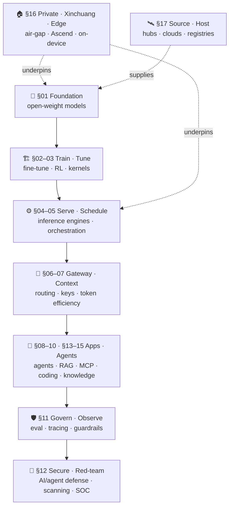

# 🧭 Awesome Enterprise AI — the CAIO List

**An adoption-first index of open-source AI for the enterprise — curated through the eyes of a CAIO.**

*面向 CAIO（首席 AI 官 / AI 负责人）的「可引入性」开源索引。*
*Not the coolest projects — the ones you can actually bring into a company.*

[🌐 caiohome.com](https://www.caiohome.com) · [📜 Canon](#00--philosophy--concepts--the-caio-canon) · [🏷️ Legend](#legend) · [🧱 Starter Stack](#reference-starter-stack) · [🗺️ Decision Chain](#the-caio-decision-chain) · [🗂️ Contents](#contents) · [🤝 Contribute](CONTRIBUTING.md)

---

> **The one question this list answers:**
> *"Can this open-source project be brought into my company — to which layer, used by whom, under what license, and at how much compliance risk?"*
>
> 本清单只回答一件事：**「这个开源项目能不能引入公司、引入到哪一层、谁来用、什么许可证、合规风险多大」**。
> Maintained by **CAIO之家 · [caiohome.com](https://www.caiohome.com)** — the home for Chief AI Officers.

Every other `awesome` list organizes by *technical category* or *research topic*, serving engineers and researchers. This one flips the axis: it is organized by the **CAIO adoption decision chain**, and every entry carries a set of **enterprise metadata tags** and a **direct link to its source**. Anyone can copy the entries — nobody can copy the *judgment*. That judgment is the only reason this list exists.

<b>📖 Why another list? · 为什么再做一个清单</b>

 

Awesome-LLM, Awesome-LLMOps, awesome-mcp-servers and friends are excellent — but they answer *"what exists?"*. A CAIO needs to answer *"what can I safely ship, and what will legal/security say?"* The market is full of 50k-star projects that no enterprise can touch (wrong license, no air-gap, single-vendor lock-in), and 800-star projects that are perfect to adopt.

So here the organizing principle is the **introduction decision** itself. A `🔴`-license 50k-star repo can be worth *less* to your company than a `🟢`-license 800-star one. Stars are not an inclusion criterion.

市面上的 awesome 清单按技术类别组织，服务工程师与研究者。本清单换一根轴 —— 按 **CAIO 的引入决策链** 分层，并要求每个条目挂一套企业元数据 + 一个可点击的源头链接。抄条目容易，抄不走这套「引入判断」。

---

## Legend

> Tags are **decision aids, not endorsements.** Final adoption rests with your legal, compliance, and security review.
> 标签是判断辅助，不是背书。最终引入决策以公司法务、合规、安全评审为准。
>
> **License `🟢🟡🔴` and Maturity `⭐🧪👀` are required on every entry.** Other tags are best-effort. **Every project name is a link to its first-party source.**

| Axis | Values |
| --- | --- |
| **License · 许可证** | 🟢 **Permissive** — Apache-2.0 / MIT / BSD, commercial use out of the box · 🟡 **Conditional** — MPL / LGPL / model "community" licenses, commercial with strings (read the terms) · 🔴 **Restricted** — GPL / AGPL / RAIL / non-commercial / custom, **legal review mandatory** |
| **Maturity · 成熟度** | ⭐ **Production** — proven at scale, de-facto standard · 🧪 **Pilot** — engineering-complete, good for a 30–90 day trial · 👀 **Watch** — important direction, still moving, track before adopting |
| **Deployment · 部署** | 🏠 **Self-hostable** — on-prem / air-gap, data never leaves · ☁️ **Cloud-first** — private deploy is costly · 📱 **Edge** — runs on-device / edge box |
| **Origin · 来源** | 🇨🇳 **China-led** · 🌍 **Global / overseas-led** |
| **Compliance · 合规** | 🛡️ **Xinchuang-ready** — adapted to Ascend / domestic silicon · ⚠️ **Sensitive** — data-residency / privacy / needs medical-affairs or legal sign-off |

<b>✅ Inclusion criteria · 收录标准</b>

 

**Included** — must satisfy *all*:
1. **Open source** with a stated OSS license (and we note the license type).
2. **Enterprise-introducible** — real production or pilot value; not a demo / toy.
3. **Maps to a layer** of the CAIO decision chain (see Contents).
4. **Active or de-facto standard** — meaningful update in the last ~6 months, *or* already the standard in its niche.
5. **Metadata complete** — at minimum license + maturity.
6. **First-party first** — official org accounts beat personal forks beat second-hand aggregators.

**Not included / footnoted only:**
- Closed SaaS (unless it has an OSS core; commercial products appear only as "for comparison" notes).
- Pure academic repros with no engineering, unmaintained and without replacement value.
- Repos with unclear or contradictory licensing (until clarified).
- Hype forks / mirrors / marketing repos.

---

## The CAIO Decision Chain

> The figure the original notes referred to, drawn for real. Read it top→bottom: each layer is a place where a CAIO makes an *introduce / don't-introduce* call. The private/Xinchuang layer **underpins** everything when data residency is a hard constraint.

---

## Reference Starter Stack

> 🧱 The list's strongest CAIO opinion: an **assembled, coherent open-source stack** you could actually pilot — not 150 disconnected links. Swap freely, but this is a sane default for a regulated/enterprise pilot with a multi-source model policy.

| Layer | Default pick (OSS) | Xinchuang / air-gap swap | Why |
| --- | --- | --- | --- |
| **Models** | `Qwen` + `DeepSeek` (+ `Llama` backup) | same (all self-hostable) | Multi-source: 2 China-led + 1 global backup |
| **Inference** | [vLLM](#04--inference-engines) | `vllm-ascend` | Throughput standard; Ascend backend exists |
| **Orchestration** | [Ray Serve](#05--compute-scheduling--serving-orchestration) / [llm-d](#05--compute-scheduling--serving-orchestration) | Ray Serve | Autoscaling, multi-model, K8s-native |
| **Gateway** | [LiteLLM](#06--gateway--routing--api--cost-governance) / [One-API](#06--gateway--routing--api--cost-governance) | One-API (self-host) | Keys · quota · billing · audit in one place |
| **Agents / Apps** | [LangGraph](#08--orchestration-frameworks--agents) + [Dify](#08--orchestration-frameworks--agents) | Dify (private) | Controllable, auditable orchestration |
| **RAG** | [RAGFlow](#10--rag--knowledge-base--data-processing) + [Milvus](#10--rag--knowledge-base--data-processing) + [BGE](#10--rag--knowledge-base--data-processing) + [MinerU](#10--rag--knowledge-base--data-processing) | same (all 🏠) | Parsing quality is the real RAG bottleneck |
| **Govern** | [Langfuse](#11--evaluation--observability--guardrails--governance) + [promptfoo](#11--evaluation--observability--guardrails--governance) + [NeMo Guardrails](#11--evaluation--observability--guardrails--governance) | Langfuse (self-host) | Without this layer, nothing is board-defensible |
| **Secure** | [Trivy](#12--security-red-teaming--aiagent-defense) + [garak](#12--security-red-teaming--aiagent-defense) / [PyRIT](#12--security-red-teaming--aiagent-defense) + [CyberSecurity-Skills](#12--security-red-teaming--aiagent-defense) | same (all 🏠) | Scan the supply chain, red-team the models, run security as agent skills |
| **Base** | [MindSpore / CANN](#16--private--xinchuang--edge-deployment) | — | Domestic training/inference stack |

> 🔒 **Air-gap variant:** for a fully self-carried, zero-egress kit (Skills + MCP + Agents + offline model/RAG), see [The Air-gap Bundle](#-the-air-gap-bundle--what-to-self-carry-behind-the-firewall-lan-ready) and the shippable [`/bundle`](bundle/) starter files.

---

## Contents

- [🏷️ Legend](#legend) · [🗺️ Decision Chain](#the-caio-decision-chain) · [🧱 Starter Stack](#reference-starter-stack)
- [00 · Philosophy & Concepts — The CAIO Canon](#00--philosophy--concepts--the-caio-canon)
- [01 · Foundation Models & Open Weights](#01--foundation-models--open-weights)
- [02 · Training / Fine-tuning / Post-training (incl. RL)](#02--training--fine-tuning--post-training-incl-rl)
- [03 · High-performance Kernels & Low-level Systems](#03--high-performance-kernels--low-level-systems)
- [04 · Inference Engines](#04--inference-engines)
- [05 · Compute Scheduling & Serving Orchestration](#05--compute-scheduling--serving-orchestration)
- [06 · Gateway / Routing / API & Cost Governance](#06--gateway--routing--api--cost-governance)
- [07 · Context Engineering & Token Efficiency](#07--context-engineering--token-efficiency)
- [08 · Orchestration Frameworks & Agents](#08--orchestration-frameworks--agents)
- [09 · MCP / Tools / Skills](#09--mcp--tools--skills)
- [10 · RAG / Knowledge Base / Data Processing](#10--rag--knowledge-base--data-processing)
- [11 · Evaluation / Observability / Guardrails / Governance](#11--evaluation--observability--guardrails--governance)
- [12 · Security, Red-Teaming & AI/Agent Defense](#12--security-red-teaming--aiagent-defense)
- [13 · Autonomous Research & Scientific Discovery](#13--autonomous-research--scientific-discovery)
- [14 · Vibe Coding — Enterprise R&D Enablement](#14--vibe-coding--enterprise-rd-enablement)
- [15 · Internal Knowledge Base — Research, Docs & Web Collection](#15--internal-knowledge-base--research-docs--web-collection)
- [16 · Private / Xinchuang / Edge Deployment](#16--private--xinchuang--edge-deployment)
- [17 · Platforms, Hubs & Registries — where CAIOs source & host](#17--platforms-hubs--registries--where-caios-source--host)
- [18 · Orgs & People to Follow (open-source account index)](#18--orgs--people-to-follow-open-source-account-index)
- [19 · Other Awesome Lists (meta-index)](#19--other-awesome-lists-meta-index)
- [20 · Department & Vertical Agent Applications](#20--department--vertical-agent-applications)
- [🤝 Contributing](#contributing) · [⚖️ Disclaimer](#disclaimer)

> Each section below gives **representative anchor entries** that demonstrate the tagging format; full coverage is community-driven (see [Contributing](CONTRIBUTING.md)).

---

## 00 · Philosophy & Concepts — The CAIO Canon

> **Why this comes first:** tools change every quarter; *judgment* compounds. Before the stack, a CAIO needs a clear head about what these systems are, where they're heading, and how to deploy them without self-deception. These are **ideas, not adoption entries** — no license/maturity tags; each links to its **first-party source** (essay, talk or post). Read them to calibrate the decisions every later section asks you to make.
> 引入逻辑：工具每季度都在变，唯有判断力会复利。这一层是「大佬们怎么想」的原文索引 —— 不是可引入条目、没有许可证标签，只给原文链接，用来校准后面每一层的决策。

**Andrej Karpathy — the paradigm shift**
- **[Software 2.0](https://karpathy.medium.com/software-2-0-a64152b37c35)** — *2017.* Neural nets are a new kind of software: you curate **data** and optimize weights instead of writing explicit logic — rethink your whole software supply chain around datasets.
- **[Software Is Changing (Again) — "Software 3.0"](https://www.youtube.com/watch?v=LCEmiRjPEtQ)** — *YC AI Startup School, 2025.* LLMs are a new computer/OS and **English is the programming interface**; treat models as fallible "people spirits," keep a human on the **autonomy slider**, and build products for agents. ([YC writeup](https://www.ycombinator.com/library/MW-andrej-karpathy-software-is-changing-again))
- **[Intro to Large Language Models — the "LLM OS"](https://www.youtube.com/watch?v=zjkBMFhNj_g)** — *2023.* The best plain-English mental model of an LLM as an OS kernel (context window = RAM, tools = peripherals) — ideal onboarding for non-technical leadership.
- **["The hottest new programming language is English"](https://x.com/karpathy/status/1617979122625712128)** — *2023.* Natural language becomes the primary interface to computers — a shift in *who* can build software.
- **[The origin of "vibe coding"](https://x.com/karpathy/status/1886192184808149383)** — *2025.* Describe intent, let the model generate; productive for prototypes, but output must be **verified, not trusted** (see §14).
- **["AGI is still a decade away" — Dwarkesh Podcast](https://www.dwarkesh.com/p/andrej-karpathy)** — *2025.* It's the **decade of agents**, not the year: today's agents lack continual learning and robust multimodality — calibrate enterprise timelines accordingly.
- **[2025 LLM Year in Review](https://karpathy.bearblog.dev/year-in-review-2025/)** — *2025.* The year's real shift was **RL from verifiable rewards**: models become "jagged" — superhuman where outputs can be checked (code, math), weak elsewhere — which predicts *which of your workflows automate first*.
- **[Sequoia AI Ascent 2026 fireside](https://karpathy.bearblog.dev/sequoia-ascent-2026/)** — *2026.* Dec 2025 was the agentic inflection point; durable advantage = finding **verifiable business domains** the labs haven't trained on and building your own RL environments — and making your product **agent-native** (APIs/CLIs, not clicks).
- **[The Unreasonable Effectiveness of Recurrent Neural Networks](https://karpathy.github.io/2015/05/21/rnn-effectiveness/)** — *2015.* The foundational "wow" of generative sequence models — a historical anchor for how far language modeling has come.

**OpenAI — Sam Altman & the enterprise**
- **[The Intelligence Age](https://ia.samaltman.com/)** — *Altman, 2024.* Deep learning works and scales; plan for **abundant intelligence** reshaping every industry, not a novelty.
- **[Three Observations](https://blog.samaltman.com/three-observations)** — *Altman, 2025.* Intelligence scales with the log of compute; cost per unit of intelligence falls ~10× a year — budget around a steep cost-down curve.
- **[The Gentle Singularity](https://blog.samaltman.com/the-gentle-singularity)** — *Altman, 2025.* The takeoff is underway but feels gradual; agents doing real cognitive work are the near-term inflection — position now, don't wait for a "moment."
- **[Moore's Law for Everything](https://moores.samaltman.com/)** — *Altman, 2021.* If AI drives the cost of goods and services toward zero, the **governance** question — who captures the value — matters as much as the tech.
- **[A Practical Guide to Building Agents (PDF)](https://cdn.openai.com/business-guides-and-resources/a-practical-guide-to-building-agents.pdf)** — *OpenAI, 2025.* A concrete field guide: when to build an agent, tool/instruction design, orchestration patterns and guardrails.
- **[AI in the Enterprise](https://openai.com/index/ai-in-the-enterprise/)** — *OpenAI, 2025.* Seven adoption lessons from frontier companies: start with evals, embed AI in products, invest early, get experts hands-on, set bold automation goals.
- **[The State of Enterprise AI](https://openai.com/index/the-state-of-enterprise-ai-2025-report/)** — *OpenAI, 2026.* The telemetry successor to *AI in the Enterprise*: reasoning-token consumption per org up **320×** YoY, workers save 40–60 min/day, frontier firms send 2× messages per seat vs the median.
- **[Introducing OpenAI Frontier](https://openai.com/index/introducing-openai-frontier/)** — *OpenAI, 2026.* The enterprise platform pitch: deploy and manage agents "like employees" — shared context, onboarding, permissions. The clearest vendor signal that the bottleneck has moved from model intelligence to **agent operations**.

**Anthropic — Dario Amodei & agent engineering**
- **[Machines of Loving Grace](https://www.darioamodei.com/essay/machines-of-loving-grace)** — *Amodei, 2024.* The concrete optimistic case: "powerful AI" could compress 50–100 years of scientific progress into 5–10 across biology, health and the economy.
- **[Building Effective Agents](https://www.anthropic.com/engineering/building-effective-agents)** — *Anthropic, 2024.* Start simple: most value comes from composable **workflows**, not autonomous loops — add agentic complexity only when it measurably pays off. The most-cited agent-design piece.
- **[Effective Context Engineering for AI Agents](https://www.anthropic.com/engineering/effective-context-engineering-for-ai-agents)** — *Anthropic, 2025.* Context is a finite, managed resource; curating *what enters the window* is the core reliability discipline (see §07).
- **[How We Built Our Multi-Agent Research System](https://www.anthropic.com/engineering/built-multi-agent-research-system)** — *Anthropic, 2025.* Orchestrator + subagents beats a single agent on broad research — but costs far more tokens; match the pattern to task value.
- **[The Urgency of Interpretability](https://www.darioamodei.com/post/the-urgency-of-interpretability)** — *Amodei, 2025.* We deploy systems we don't fully understand; interpretability is a race to win — the governance argument behind §11.
- **[The Adolescence of Technology](https://www.darioamodei.com/essay/the-adolescence-of-technology)** — *Amodei, 2026.* The successor to *Machines of Loving Grace*: five concrete risk classes (autonomy, bio-misuse, power seizure, economic disruption, destabilization) with pragmatic remedies — the defining lab-leader risk essay of 2026.
- **[Policy on the AI Exponential](https://www.darioamodei.com/post/policy-on-the-ai-exponential)** — *Amodei, 2026.* Five policy pillars for the run-up to "a country of geniuses in a datacenter" — the reference document for regulatory horizon-scanning.
- **[Building Multi-Agent Systems: When and How](https://claude.com/blog/building-multi-agent-systems-when-and-how-to-use-them)** — *Anthropic, 2026.* The sober counterweight to multi-agent hype: it pays off only for context isolation, parallelization or specialization — most enterprise scenarios are better served by one well-scaffolded agent.
- **[Anthropic Economic Index](https://www.anthropic.com/economic-index)** — *Anthropic, 2026 (ongoing).* The only vendor index linking real usage logs to worker surveys — ground truth for what AI is *actually* used for at work.

**Google / DeepMind**
- **[Agents (whitepaper)](https://www.kaggle.com/whitepaper-agents)** — *Google / Lee Boonstra, 2024.* The canonical primer on the agent stack — model + tools + orchestration — shared vocabulary for architecture debates.
- **[Real-World Generative-AI Use Cases](https://cloud.google.com/transform/101-real-world-generative-ai-use-cases-from-industry-leaders)** — *Google Cloud, 2025.* A 600+ catalog of production deployments by industry — the best "what are peers actually shipping" reference for use-case discovery.
- **[Welcome to the Era of Experience](https://storage.googleapis.com/deepmind-media/Era-of-Experience%20/The%20Era%20of%20Experience%20Paper.pdf)** — *Silver & Sutton (DeepMind), 2025.* The next leap is agents learning from their **own streams of experience** (RL in the world), not just human data — a signal on where capability heads next.
- **[AI Agent Trends 2026 (PDF)](https://services.google.com/fh/files/misc/google_cloud_ai_agent_trends_2026_report.pdf)** + **[The ROI of AI agents](https://cloud.google.com/transform/roi-of-ai-how-agents-help-business)** — *Google Cloud, 2026.* The most-cited agent-ROI numbers of the cycle: 52% of executives have agents in production, 39% run 10+, 74% see ROI within year one.

**Microsoft — Satya Nadella**
- **[On AI as a cognitive amplifier](https://x.com/satyanadella/status/2066182223213293753)** — *Nadella, 2025.* Reframes the debate from "AI slop" and substitution toward a **theory of mind where AI is a cognitive amplifier** — scaffolding for human potential, not a replacement.
- **[Looking Ahead to 2026](https://snscratchpad.com/posts/looking-ahead-2026/)** — *Nadella, 2025.* "We will evolve from **models to systems**" — advantage shifts from raw model quality to the scaffolding that orchestrates many models and agents reliably.
- **[2025: The Year the Frontier Firm Is Born](https://www.microsoft.com/en-us/worklab/work-trend-index/2025-the-year-the-frontier-firm-is-born)** — *Microsoft Work Trend Index, 2025.* A new org model of hybrid human + agent teams; most leaders expect significant agent integration within 12–18 months.
- **[2026 Work Trend Index: Agents, Human Agency](https://news.microsoft.com/annual-work-trend-index-2026/)** — *Microsoft, 2026.* The "Transformation Paradox": workers are ready, organizations are not — org factors drive **2× more** of AI's impact than individual behavior, and only 19% of orgs sit in the "Frontier zone".

**Other voices**
- **[From Hierarchy to Intelligence](https://www.sequoiacap.com/article/from-hierarchy-to-intelligence/)** — *Jack Dorsey & Roelof Botha (Block / Sequoia), 2026.* The AI-era org needs only three kinds of people — **ICs** (judgment, taste, creativity; one person doing ten people's work), **DRIs** (own the customer outcome and assemble the team), and **Player-Coaches** (build others by *doing*, not directing). An **intelligence layer** replaces the permanent middle-management tier; the best people hold all three roles at once. ([podcast](https://www.sequoiacap.com/podcast/jack-dorsey-every-company-can-now-be-a-mini-agi/))
- **[What's Next for AI Agentic Workflows](https://www.youtube.com/watch?v=sal78ACtGTc)** — *Andrew Ng (Sequoia AI Ascent), 2024.* Agentic patterns — reflection, tool use, planning, multi-agent — dramatically outperform single-shot prompting; the biggest near-term capability lever.
- **["2026: This Is AGI"](https://sequoiacap.com/article/2026-this-is-agi/)** — *Grady & Huang (Sequoia), 2026.* Long-horizon agents are functionally AGI: 2022–24 chat, 2024–25 reasoning, 2026 agents-as-colleagues — with coding as the first domino. The board-deck shorthand for the agent era.
- **[Stanford AI Index 2026](https://hai.stanford.edu/ai-index/2026-ai-index-report)** — *Stanford HAI, 2026.* The neutral yardstick for any board deck: 88% organizational adoption, gen-AI reached 53% population adoption in 3 years (faster than PC or internet).
- **[AI at Work 2026](https://www.bcg.com/publications/2026/ai-at-work-why-strategy-matters-more-than-tools)** — *BCG, 2026.* ~12,000 workers, 12+ markets: regular users save ~8 hrs/week — and an explicit AI **strategy beats better tools ~5:1** on impact.

> 🧭 Read top-to-bottom, these converge on one message for a CAIO: **the models are a moving target; your durable edge is judgment, governance, and how you wire intelligence into real work** — exactly what §01–§19 operationalize.

## 01 · Foundation Models & Open Weights

> **Adoption logic:** fix your base first. A *"2 China-led + 1 global/open backup"* multi-source policy hedges supply risk. **Weight licenses frequently differ from the code license — check each.**
> 引入逻辑：先定底座来源，注意权重许可证常与代码许可证不同。

- **[DeepSeek](https://github.com/deepseek-ai)** (`deepseek-ai`) 🇨🇳 ⭐ 🟢 — V/R-series open weights through V4 (1M-token context), mostly MIT. Strong reasoning & code; frontier parity at a fraction of closed-model cost.
- **[Qwen](https://github.com/QwenLM)** (`QwenLM`) 🇨🇳 ⭐ 🟢 — Full size range + native multimodal (Qwen3.x ladder), mostly Apache-2.0; the enterprise-friendly default.
- **[GLM](https://github.com/zai-org)** (`zai-org` / `THUDM`) 🇨🇳 ⭐ 🟢🟡 — GLM series; [GLM-5](https://github.com/zai-org/GLM-5) ships Apache-2.0 and GLM-5.2 MIT, but some earlier versions carry usage terms — confirm per model.
- **[Kimi](https://github.com/MoonshotAI)** (`moonshotai`) 🇨🇳 ⭐ 🟢 — Long-context & agentic open weights (K2.x under modified MIT — attribution only above very large scale thresholds).
- **[MiniMax](https://github.com/MiniMax-AI)** (`MiniMax-AI`) 🇨🇳 ⭐ 🟢 — Open-weight large models with long context; the M2.x agentic line adds office-work fluency (docs / sheets / decks).
- **[MiMo-Code](https://github.com/XiaomiMiMo/MiMo-Code)** (`XiaomiMiMo` / Xiaomi) 🇨🇳 🧪 🟢 🏠 — Open coding model where "models and agents co-evolve" (weights + agent harness); MIT — clean for commercial use.
- **[Step](https://github.com/stepfun-ai/Step-3.7-Flash)** (`stepfun-ai` / StepFun 阶跃星辰) 🇨🇳 🧪 🟢 — Step-3.7-Flash sparse MoE with native image + video understanding and top-ranked output speed — the open multimodal speed/price point for real-time agents.
- **[MiniCPM](https://github.com/OpenBMB/MiniCPM)** (`OpenBMB`) 🇨🇳 ⭐ 🟡 📱 — Edge-friendly small models.
- **[Llama](https://github.com/meta-llama)** (`meta-llama`) 🌍 ⭐ 🟡 — Llama Community License (includes an MAU-threshold clause); **not pure OSS**.
- **[Mistral](https://github.com/mistralai)** / **[Gemma](https://ai.google.dev/gemma)** / **[Phi](https://huggingface.co/microsoft)** (`mistralai` / `google` / `microsoft`) 🌍 ⭐ 🟢🟡 — overseas open-weight reference points.
- **[gpt-oss](https://github.com/openai/gpt-oss)** (`openai`) 🌍 ⭐ 🟢 — OpenAI's first open-weight models (120B / 20B), Apache-2.0; enterprise-safe license, a Western open-weight anchor.
- **[OLMo](https://github.com/allenai/OLMo)** (`allenai`) 🌍 🧪 🟢 — Fully open model (training data + code + weights); the reference when full reproducibility / auditability is the requirement.

> ⚠️ Verify weight licenses one by one: Apache/MIT are commercial-safe; "community licenses" need legal to read the clauses (commercial caps, naming, acceptable-use).

## 02 · Training / Fine-tuning / Post-training (incl. RL)

> **Adoption logic:** 99% of enterprises do not pretrain. The action is in **fine-tuning** (domain adaptation) and **post-training / RL** (alignment + reasoning gains).
> 引入逻辑：重点是微调（领域适配）与后训练/RL（对齐与推理增强）。

**Distributed pretraining / large-scale training**
- **[Megatron-LM](https://github.com/NVIDIA/Megatron-LM)** (`NVIDIA`) 🌍 ⭐ 🟢 — A de-facto standard for large-scale parallel training.
- **[DeepSpeed](https://github.com/deepspeedai/DeepSpeed)** (`deepspeedai`) 🌍 ⭐ 🟢 — ZeRO optimization; memory & throughput.
- **[NeMo](https://github.com/NVIDIA-NeMo)** (`NVIDIA-NeMo`) 🌍 ⭐ 🟢 — End-to-end training framework, now split into per-domain repos ([Speech](https://github.com/NVIDIA-NeMo/Speech) · [Automodel](https://github.com/NVIDIA-NeMo/Automodel) · [Megatron-Bridge](https://github.com/NVIDIA-NeMo/Megatron-Bridge)); 🛡️ evaluate on non-Ascend domestic chips.
- **[ColossalAI](https://github.com/hpcaitech/ColossalAI)** (`hpcaitech`) 🧪 🟢 — Parallel-training toolbox.
- **[TorchTitan](https://github.com/pytorch/torchtitan)** (`pytorch`) 🧪 🟢 — PyTorch-native large-model training reference.

**Fine-tuning (most common)**
- **[LLaMA-Factory](https://github.com/hiyouga/LlamaFactory)** (`hiyouga`) 🇨🇳 ⭐ 🟢 🏠 — One-stop fine-tuning; the most widely deployed in China.
- **[ms-swift](https://github.com/modelscope/ms-swift)** (`modelscope`) 🇨🇳 ⭐ 🟢 🏠 🛡️ — ModelScope training/tuning suite; good domestic-ecosystem fit.
- **[Unsloth](https://github.com/unslothai/unsloth)** (`unslothai`) 🌍 ⭐ 🟢 — Efficient single-GPU fine-tuning; saves VRAM.
- **[Axolotl](https://github.com/axolotl-ai-cloud/axolotl)** (`axolotl-ai-cloud`) 🌍 ⭐ 🟢 — Config-driven fine-tuning.
- **[TRL](https://github.com/huggingface/trl)** (`huggingface`) 🌍 ⭐ 🟢 — HF post-training library (SFT / DPO / GRPO).

**RLHF / RL (the reasoning-boost hot zone)**
- **[verl](https://github.com/verl-project/verl)** (`verl-project`, ex-`volcengine`) 🇨🇳 ⭐ 🟢 — ByteDance Seed's production-grade RL framework (HybridFlow).
- **[OpenRLHF](https://github.com/OpenRLHF/OpenRLHF)** (`OpenRLHF`) 🌍 ⭐ 🟢 — Early-popular, approachable RLHF library.
- **[ROLL](https://github.com/alibaba/ROLL)** (`alibaba`) 🇨🇳 🧪 🟢 — Alibaba large-scale RL framework.
- **[AReaL](https://github.com/areal-project/AReaL)** (`areal-project` / Ant) 🇨🇳 🧪 🟢 — Asynchronous RL, throughput-focused.
- **[slime](https://github.com/THUDM/slime)** (`THUDM`) 🇨🇳 🧪 🟢 — Zhipu/Tsinghua-lineage RL scaling.
- **[NeMo-RL](https://github.com/NVIDIA-NeMo/RL)** (`NVIDIA-NeMo`) 🌍 🧪 🟢 — NVIDIA post-training RL.
- **[DAPO](https://github.com/BytedTsinghua-SIA/DAPO)** (`BytedTsinghua-SIA`) 🇨🇳 👀 🟢 — ByteDance × Tsinghua open RL system/algorithm + dataset (built on verl).
- **[ART (Agent Reinforcement Trainer)](https://github.com/OpenPipe/ART)** (`OpenPipe`) 🌍 ⭐ 🟢 — GRPO-based RL to give multi-step **agents** "on-the-job" training on open weights (Qwen, gpt-oss, Llama); practical post-training for real agent tasks, not just chat.

**Learn from scratch (capability-building for your seed engineers)**
- **[Karpathy](https://github.com/karpathy)** (`karpathy`) 🌍 ⭐ 🟢 — [nanoGPT](https://github.com/karpathy/nanoGPT) / [llm.c](https://github.com/karpathy/llm.c) / [nanochat](https://github.com/karpathy/nanochat) / [micrograd](https://github.com/karpathy/micrograd); the best "understand LLMs from zero" teaching code.

## 03 · High-performance Kernels & Low-level Systems

> **Adoption logic:** in-house teams need these; almost everyone else only *uses* them, never *edits* them. Understanding them is what lets you push inference/training cost down.
> 引入逻辑：绝大多数公司只「用」不「改」，但理解它们决定你能不能压低成本。

- **[DeepSeek open-infra-index](https://github.com/deepseek-ai/open-infra-index)** (`deepseek-ai`) 🇨🇳 ⭐ 🟢 — Index of [FlashMLA](https://github.com/deepseek-ai/FlashMLA) (MLA decode kernel), [DeepEP](https://github.com/deepseek-ai/DeepEP) (MoE comm library), [DeepGEMM](https://github.com/deepseek-ai/DeepGEMM) (FP8 GEMM), [DualPipe](https://github.com/deepseek-ai/DualPipe) (pipeline parallel), [3FS](https://github.com/deepseek-ai/3FS) (parallel filesystem). Production-validated, mostly MIT.
- **[FlashAttention](https://github.com/Dao-AILab/flash-attention)** (`Dao-AILab`) 🌍 ⭐ 🟢 — The attention-acceleration standard.
- **[FlashInfer](https://github.com/flashinfer-ai/flashinfer)** (`flashinfer-ai`) 🌍 ⭐ 🟢 — Kernel library for LLM serving (attention, MoE, sampling); the de-facto kernel backend under vLLM / SGLang / TensorRT-LLM.
- **[Triton](https://github.com/triton-lang/triton)** (`triton-lang`) 🌍 ⭐ 🟢 — Language for writing GPU kernels.
- **[CUTLASS](https://github.com/NVIDIA/cutlass)** (`NVIDIA`) 🌍 ⭐ 🟢 — CUDA matrix-op template library.
- **[Liger-Kernel](https://github.com/linkedin/Liger-Kernel)** (`linkedin`) 🌍 🧪 🟢 — Fused training kernels; saves VRAM.
- **[DeepSpec](https://github.com/deepseek-ai/DeepSpec)** (`deepseek-ai`) 🇨🇳 🧪 🟢 — Full-stack codebase for training and evaluating **speculative decoding** — the reference stack for the biggest current inference cost-cut lever; MIT.

## 04 · Inference Engines

> **Adoption logic:** this is the **main cost battleground.** Engine choice directly sets per-GPU throughput and concurrency cost.
> 引入逻辑：降本主战场，引擎选型直接决定单卡吞吐与并发成本。

- **[vLLM](https://github.com/vllm-project/vllm)** (`vllm-project`) 🌍 ⭐ 🟢 🏠 — High-throughput inference standard (PagedAttention); 🛡️ [`vllm-ascend`](https://github.com/vllm-project/vllm-ascend) Ascend fork exists.
- **[SGLang](https://github.com/sgl-project/sglang)** (`sgl-project`) 🌍 ⭐ 🟢 🏠 — High-performance serving; common for RAG / structured output.
- **[TensorRT-LLM](https://github.com/NVIDIA/TensorRT-LLM)** (`NVIDIA`) 🌍 ⭐ 🟢 — Peak optimization on NVIDIA GPUs.
- **[LMDeploy](https://github.com/InternLM/lmdeploy)** (`InternLM`) 🇨🇳 ⭐ 🟢 🏠 — InternLM team's deploy stack; domestic-ecosystem friendly.
- **[llama.cpp](https://github.com/ggml-org/llama.cpp)** (`ggml-org`) 🌍 ⭐ 🟢 🏠 📱 — CPU / edge / quantized deployment.
- **[Xinference](https://github.com/xorbitsai/inference)** (`xorbitsai`) 🇨🇳 🧪 🟢 🏠 — Multi-model local inference server.
- **[KTransformers](https://github.com/kvcache-ai/ktransformers)** (`kvcache-ai` / Tsinghua) 🇨🇳 ⭐ 🟢 🏠 — Heterogeneous CPU+GPU offload that runs huge MoE models (DeepSeek / Kimi-class) on limited GPU — slashes hardware cost for on-prem serving of frontier-size open weights.
- **[xLLM](https://github.com/jd-opensource/xllm)** (`jd-opensource` / JD.com) 🇨🇳 🧪 🟢 🏠 — Production inference engine for LLM / VLM / DiT / REC, optimized for **diverse / domestic AI accelerators** — a path for sovereign-chip (Xinchuang) or non-NVIDIA fleets.
- **[ds4](https://github.com/antirez/ds4)** (`antirez`) 🌍 🧪 🟢 🏠 — DeepSeek-4 Flash/Pro local inference engine for Metal / CUDA / ROCm by the Redis creator; a credible single-purpose, fully offline alternative to llama.cpp for the strongest open-weight family.
- **[omlx](https://github.com/jundot/omlx)** (`jundot`) 🌍 🧪 🟢 🏠 📱 — Inference server with continuous batching + SSD KV-cache for **Apple Silicon** — turns enterprise Mac fleets into viable inference nodes for large MoE models.

## 05 · Compute Scheduling & Serving Orchestration

> **Adoption logic:** once you have multi-GPU / multi-node clusters, you need a layer *above* the engine for load balancing, autoscaling, and multi-tenancy.
> 引入逻辑：引擎之上需要调度与编排做负载均衡、扩缩容、多租户。

- **[llm-d](https://github.com/llm-d/llm-d)** (`llm-d`) 🌍 🧪 🟢 🏠 — vLLM/SGLang orchestration on K8s: smart routing, tiered KV-cache, prefill/decode disaggregation, SLO autoscaling.
- **[llmaz](https://github.com/InftyAI/llmaz)** (`InftyAI`) 🌍 🧪 🟢 🏠 — Lightweight inference platform on K8s.
- **[K8s scheduler-plugins](https://github.com/kubernetes-sigs/scheduler-plugins)** (`kubernetes-sigs`) 🌍 ⭐ 🟢 🏠 — GPU scheduling plugins.
- **[Ray / Ray Serve](https://github.com/ray-project/ray)** (`ray-project`) 🌍 ⭐ 🟢 🏠 — Distributed serving & orchestration; elastic, multi-model.
- **[KServe](https://github.com/kserve/kserve)** (`kserve`) 🌍 ⭐ 🟢 🏠 — The K8s model-serving standard.
- **[NVIDIA Triton](https://github.com/triton-inference-server/server)** + **[Dynamo](https://github.com/ai-dynamo/dynamo)** (`triton-inference-server` / `ai-dynamo`) 🌍 ⭐ 🟢 — Official inference serving, enterprise support.
- **[BentoML](https://github.com/bentoml/BentoML)** / **[OpenLLM](https://github.com/bentoml/OpenLLM)** (`bentoml`) 🌍 ⭐ 🟢 🏠 — Packaging & deployment.
- **[AIBrix](https://github.com/vllm-project/aibrix)** (`vllm-project`) 🌍 🧪 🟢 🏠 — Cost-efficient, pluggable K8s infra for LLM inference (ByteDance-origin): LLM-aware autoscaling, KV-cache offload, routing.
- **[LMCache](https://github.com/LMCache/LMCache)** (`LMCache`) 🌍 🧪 🟢 🏠 — KV-cache layer that accelerates serving via cross-request reuse / offload; pairs with vLLM and llm-d.
- **[OME (Open Model Engine)](https://github.com/ome-projects/ome)** (`ome-projects`) 🌍 🧪 🟢 🏠 — K8s operator for LLM serving: engine-agnostic model lifecycle, GPU scheduling and prefill/decode disaggregation across SGLang / vLLM / TensorRT-LLM / Triton.
- **[kvcached](https://github.com/ovg-project/kvcached)** (`ovg-project`) 🌍 🧪 🟢 🏠 — Virtualized, elastic KV-cache that lets multiple models share GPU memory dynamically; raises utilization on expensive fleets (distinct from LMCache offload).
- **[checkpoint-engine](https://github.com/MoonshotAI/checkpoint-engine)** (`MoonshotAI`) 🇨🇳 🧪 🟢 🏠 — Lightweight middleware to hot-update model weights in running inference engines; for RLHF online updates and zero-downtime model swaps.
- **[Mooncake](https://github.com/kvcache-ai/Mooncake)** (`kvcache-ai` / Moonshot) 🇨🇳 ⭐ 🟢 🏠 — KV-cache-centric **disaggregated** (prefill/decode split) serving platform that powers Kimi in production; pairs with vLLM / SGLang for large-scale, cost-efficient inference.
- **[GPUStack](https://github.com/gpustack/gpustack)** (`gpustack` / Seal) 🇨🇳 ⭐ 🟢 🏠 — Self-hosted GPU-cluster manager that schedules and serves models across vLLM / SGLang (and Ascend / MindIE) nodes — an air-gappable control plane for heterogeneous fleets.

## 06 · Gateway / Routing / API & Cost Governance

> **Adoption logic:** the **first piece of enterprise AI infrastructure** — unify multi-source access, keys/quota/billing, audit, rate-limit, fallback.
> 引入逻辑：企业级 AI「第一块基础设施」，统一接入与治理。

**LLM gateways / API aggregation**
- **[LiteLLM](https://github.com/BerriAI/litellm)** (`BerriAI`) 🌍 ⭐ 🟢 🏠 — Widest ecosystem, fastest to integrate, self-hostable.
- **[Portkey Gateway](https://github.com/Portkey-AI/gateway)** (`Portkey-AI`) 🌍 ⭐ 🟢 🏠 — Routing / caching / guardrails / observability / budget control.
- **[Kong AI Gateway](https://github.com/Kong/kong)** (`Kong`) 🌍 ⭐ 🟢 — AI features on a mature API gateway; first choice if you already run Kong.
- **[Helicone](https://github.com/Helicone/helicone)** (`Helicone`) 🌍 🧪 🟢 🏠 — Lightweight gateway/observability, easy to integrate.
- **[One-API](https://github.com/songquanpeng/one-api)** (`songquanpeng`, 🟢 MIT) / **[New-API](https://github.com/QuantumNous/new-api)** (`QuantumNous`, 🔴 AGPL-3.0) 🇨🇳 ⭐ 🏠 — Multi-tenant gateways with keys/quota/billing/audit; a top self-host choice in China. ⚠️ New-API is **AGPL** — legal review before SaaS redistribution.
- **[Higress](https://github.com/higress-group/higress)** (`higress-group` / Alibaba) 🇨🇳 ⭐ 🟢 🏠 — AI-native API gateway (Envoy-based) with token rate-limiting, semantic cache and content-safety plugins; China-origin, good Xinchuang/medical-content-safety story.
- **[Envoy AI Gateway](https://github.com/envoyproxy/ai-gateway)** (`envoyproxy` / CNCF) 🌍 🧪 🟢 🏠 — CNCF-backed, Envoy-native unified gateway for GenAI traffic; the natural fit for enterprises already standardized on Envoy / Kubernetes.
- **[Bifrost](https://github.com/maximhq/bifrost)** (`maximhq`) 🌍 ⭐ 🟢 🏠 — High-throughput AI gateway (claims ~50× LiteLLM, <100µs overhead at 5k RPS) with adaptive load balancing, cluster mode, guardrails and 1000+ models.
- **[Plano (ex-Arch)](https://github.com/katanemo/plano)** (`katanemo`) 🌍 ⭐ 🟢 🏠 — Envoy-based AI-native proxy / data plane for agentic apps: smart LLM routing, safety and observability at the edge of every agent call.

**Model routing (pick a model per prompt — cut cost, raise quality)**
- **[RouteLLM](https://github.com/lm-sys/RouteLLM)** (`lm-sys`) 🌍 🧪 🟢 — Strong/weak model routing framework.
- **[Semantic Router](https://github.com/aurelio-labs/semantic-router)** (`aurelio-labs`) 🌍 🧪 🟢 — Routing on semantic embeddings.

> ⚠️ The gateway is where keys and logs converge — design security / audit / PII-redaction *here*; it's the cheapest place to do it.

## 07 · Context Engineering & Token Efficiency

> **Adoption logic:** cuts the API/inference bill directly. As "Vibe Coding" scales across your dev team, token cost rises — this layer is explicit ROI.
> 引入逻辑：直接砍 API/推理账单，显性 ROI。

- **[rtk (Rust Token Killer)](https://github.com/rtk-ai/rtk)** (`rtk-ai`) 🌍 ⭐ 🟢 🏠 — CLI proxy that filters/compresses command output before it enters context; saves 60–90% tokens; transparent hooks into Claude Code / Codex / Cursor / Gemini CLI.
- **[Headroom](https://github.com/headroomlabs-ai/headroom)** (`headroomlabs-ai`) 🌍 ⭐ 🟢 🏠 — Compresses tool outputs, logs, files and RAG chunks **60–95%** before they reach the LLM; library, proxy or MCP modes — a drop-in inference-bill cut at the gateway layer.
- **[LLMLingua](https://github.com/microsoft/LLMLingua)** (`microsoft`) 🌍 🧪 🟢 — Prompt / context compression.
- **[kvpress](https://github.com/NVIDIA/kvpress)** (`NVIDIA`) 🌍 🧪 🟢 — KV-cache compression toolkit (a library of "press" methods) to shrink long-context memory with minimal accuracy loss.
- **[Repomix](https://github.com/yamadashy/repomix)** (`yamadashy`) 🌍 ⭐ 🟢 — Pack a repo into a single file to feed a model.
- **[files-to-prompt](https://github.com/simonw/files-to-prompt)** / **[code2prompt](https://github.com/mufeedvh/code2prompt)** (`simonw` / `mufeedvh`) 🌍 🧪 🟢 — Code-context assembly.

## 08 · Orchestration Frameworks & Agents

> **Adoption logic:** the main vehicle for internal enablement (sales / support / docs / R&D). In regulated/medical settings, prefer controllable, auditable, deterministic frameworks.
> 引入逻辑：内部赋能落地的主载体；合规场景优先可控、可审计、确定性强的框架。

- **[LangGraph](https://github.com/langchain-ai/langgraph)** (`langchain-ai`) 🌍 ⭐ 🟢 🏠 — Graph-based agent orchestration; production-ready, highly controllable.
- **[LlamaIndex](https://github.com/run-llama/llama_index)** (`run-llama`) 🌍 ⭐ 🟢 🏠 — RAG / agent data framework.
- **[AutoGen](https://github.com/microsoft/autogen)** (`microsoft`) 🌍 ⭐ 🟢 — Multi-agent orchestration.
- **[DSPy](https://github.com/stanfordnlp/dspy)** (`stanfordnlp`) 🌍 🧪 🟢 — Declarative prompt / program optimization.
- **[DeerFlow](https://github.com/bytedance/deer-flow)** (`bytedance`) 🇨🇳 ⭐ 🟢 🏠 — Long-horizon **SuperAgent harness** (v2.0: sandboxes, memory, skills, subagents, message gateway) — grew from deep research into a full agent base.
- **[AgentScope](https://github.com/agentscope-ai/agentscope)** (`agentscope-ai` / Alibaba) 🇨🇳 ⭐ 🟢 🏠 — Production agent framework with fine-grained permissions, multi-tenancy, sandboxing, MCP + A2A and K8s deploy; Python / TS / **Java** — the JVM-enterprise-friendly pick.
- **[Dify](https://github.com/langgenius/dify)** (`langgenius`) 🇨🇳 ⭐ 🟢 🏠 — LLM app platform; low-code + self-hostable.
- **[MetaGPT](https://github.com/FoundationAgents/MetaGPT)** (`FoundationAgents`) 🇨🇳 ⭐ 🟢 — Multi-agent "software team" paradigm.
- **[OpenHands](https://github.com/OpenHands/OpenHands)** (`OpenHands`, ex-`All-Hands-AI`) 🌍 ⭐ 🟢 🏠 — Open-source coding agent.
- **[n8n](https://github.com/n8n-io/n8n)** (`n8n-io`) 🌍 ⭐ 🟡 🏠 — Workflow automation (Sustainable Use License — confirm terms).
- **[CrewAI](https://github.com/crewAIInc/crewAI)** (`crewAIInc`) 🌍 ⭐ 🟢 — Role-playing multi-agent orchestration; popular for collaborative agent teams.
- **[Pydantic AI](https://github.com/pydantic/pydantic-ai)** (`pydantic`) 🌍 ⭐ 🟢 — Type-safe agent framework; strong fit for controllable, testable enterprise agents.
- **[Google ADK](https://github.com/google/adk-python)** (`google`) 🌍 ⭐ 🟢 — Code-first Agent Development Kit: build, evaluate, deploy.
- **[Agno](https://github.com/agno-agi/agno)** (`agno-agi`) 🌍 ⭐ 🟢 — High-performance framework to build and run agent platforms.
- **[Bisheng](https://github.com/dataelement/bisheng)** (`dataelement`) 🇨🇳 ⭐ 🟢 🏠 — Enterprise LLM DevOps platform: workflow + RAG + agents + fine-tune + observability, self-hostable.
- **[Agent Executor (AX)](https://github.com/google/ax)** (`google`) 🌍 🧪 🟢 🏠 — Google's open-source distributed agent runtime: durable execution, snapshot/resume on crash, sandboxed isolation for long-running agentic workloads. A runtime primitive, not a framework.
- **[Symphony](https://github.com/openai/symphony)** (`openai`) 🌍 🧪 🟢 — OpenAI's open Codex-orchestration layer: turns tracker tickets into isolated, autonomous coding-agent runs so teams manage work instead of supervising agents. ⚠️ Engineering-preview — pilot, not GA.
- **[Shannon](https://github.com/Kocoro-lab/Shannon)** (`Kocoro-lab`) 🌍 🧪 🟢 🏠 — Production-oriented multi-agent orchestration on Temporal durable workflows, with budget/policy enforcement, a Rust sandbox and OpenTelemetry/Prometheus observability.
- **[agent-sandbox](https://github.com/kubernetes-sigs/agent-sandbox)** (`kubernetes-sigs`) 🌍 🧪 🟢 🏠 — Official K8s-SIG project: isolated, stateful, singleton sandboxes as a standard execution substrate for agent runtimes on existing Kubernetes.
- **[Langflow](https://github.com/langflow-ai/langflow)** (`langflow-ai`) 🌍 ⭐ 🟢 🏠 — Visual low-code builder for agents & RAG flows; self-hostable and can export a flow as an API or an MCP server — a fast on-prem path from prototype to internal tool. (Telemetry on by default; set `DO_NOT_TRACK` for air-gap.)
- **[Paperclip](https://github.com/paperclipai/paperclip)** (`paperclipai`) 🌍 ⭐ 🟢 🏠 — The de-facto open **agent workforce console**: assign, review and audit fleets of agents at work — the management layer *above* your agent frameworks.
- **[nanobot](https://github.com/HKUDS/nanobot)** (`HKUDS`) 🌍 ⭐ 🟢 🏠 — Lightweight agent runtime for tools, chats and workflows from the LightRAG group; the fastest-growing minimal harness of 2026 — tiny footprint, MIT.
- **[Page Agent](https://github.com/alibaba/page-agent)** (`alibaba`) 🇨🇳 ⭐ 🟢 🏠 — In-page GUI agent that drives a web app's DOM from natural-language instructions via a single script tag — adds an assistant layer to existing internal web tools without a rewrite; MIT.
- **[OpenSandbox](https://github.com/opensandbox-group/OpenSandbox)** (`opensandbox-group`) 🌍 🧪 🟢 🏠 — Secure, extensible sandbox runtime for agent code execution — the neutral-governance, self-hostable answer to sandbox SaaS; pairs with `agent-sandbox` above.
- **[Microsoft Agent Framework](https://github.com/microsoft/agent-framework)** (`microsoft`) 🌍 🧪 🟢 🏠 — MIT framework for building, orchestrating and deploying AI agents and multi-agent workflows in Python and .NET — the open substrate under Microsoft's closed Copilot Studio / Foundry enterprise agent story.
- **[OpenClaw](https://github.com/openclaw/openclaw)** (`openclaw`) 🌍 ⭐ 🟢 🏠 — General-purpose personal AI assistant / agent harness that has become a de-facto substrate in the China enterprise ecosystem (Kingdee's kclaw wraps it); raw LICENSE is plain MIT even though GitHub's license detector reports none.
- **[SAP Cloud SDK for AI](https://github.com/SAP/ai-sdk-js)** (`SAP`) 🌍 🧪 🟢 — Apache-2.0 official SDK (JS/TS, Java, Python) for SAP AI Core, Generative AI Hub and the Orchestration Service — the genuine open-source substrate under SAP's closed Joule-era agents.
- **[SAP Astonish](https://github.com/SAP/astonish)** (`SAP`) 🌍 👀 🟢 🏠 — SAP's own Apache-2.0 multi-tenant AI agent platform for teams (Studio, CLI, shared memory, reusable flows, generative UI, sandboxed execution); tiny community but genuinely first-party and actively pushed.
- **[Joule A2A Agent Toolkit](https://github.com/SAP-samples/joule-a2a-agent-toolkit)** (`SAP-samples`) 🌍 👀 🟢 — Apache-2.0 toolkit for building custom agents that connect into SAP Joule over the A2A protocol on BTP Cloud Foundry (TypeScript/CAP or Python/LangGraph).
- **[Agentforce Agent SDK](https://github.com/salesforce/agent-sdk)** (`salesforce`) 🌍 🧪 🟢 — Apache-2.0 Python SDK for creating, managing and running agents on Salesforce's closed Agentforce platform — the linkable OSS core for the reference closed enterprise agent suite (service / sales / marketing).

> ⚠️ Medical Class II/III: fully dynamic multi-agent systems conflict with NMPA "deterministic, auditable" requirements — freeze a traceable chain at the orchestration layer.

## 09 · MCP / Tools / Skills

> **Adoption logic:** the protocol + capability layer that lets agents safely touch enterprise systems. The enterprise focus is *gatewayed MCP + audit + permissions*.
> 引入逻辑：让 Agent 安全接入企业系统的协议层与能力层。

- **[Model Context Protocol](https://modelcontextprotocol.io)** (`modelcontextprotocol`) 🌍 ⭐ 🟢 — [Official protocol + SDKs](https://github.com/modelcontextprotocol).
- **[awesome-mcp-servers](https://github.com/punkpeye/awesome-mcp-servers)** (`punkpeye`) 🌍 — The master index of MCP servers.
- **[awesome-mcp-enterprise](https://github.com/bh-rat/awesome-mcp-enterprise)** (`bh-rat`) 🌍 — Enterprise-grade MCP subset.
- **[MCP Gateway](https://github.com/lasso-security/mcp-gateway)** (`lasso-security`) + **[mcpo](https://github.com/open-webui/mcpo)** 🌍 🧪 🟢 🏠 — MCP gateway / auth / audit.
- **[MCP Gateway (Microsoft)](https://github.com/microsoft/mcp-gateway)** (`microsoft`) 🌍 🧪 🟢 🏠 — K8s reverse proxy + control plane for MCP servers: session-aware stateful routing, lifecycle management, OAuth2 / Entra ID + RBAC. The MCP front door for Azure/K8s shops.
- **[ContextForge (MCP Gateway)](https://github.com/IBM/mcp-context-forge)** (`IBM`) 🌍 🧪 🟢 🏠 — IBM's Apache-2.0 MCP / A2A / REST gateway + registry: federate and proxy tools behind one governed front door with auth, observability and an **air-gapped container build** (`Containerfile.lite`). A clean-license alternative to AGPL registries for behind-the-firewall MCP.
- **[Archestra](https://github.com/archestra-ai/archestra)** (`archestra-ai`) 🌍 🧪 🔴 🏠 ⚠️ — Enterprise AI platform: private MCP registry + K8s MCP gateway + deterministic guardrails (prompt-injection isolation) + A2A orchestration. **AGPL-3.0 — legal review before SaaS redistribution.**
- **[Composio](https://github.com/ComposioHQ/composio)** (`ComposioHQ`) 🌍 🧪 🟢 — Tool integration.
- **[FastMCP](https://github.com/PrefectHQ/fastmcp)** (`PrefectHQ`) 🌍 ⭐ 🟢 — The fast, Pythonic way to build MCP servers and clients.
- **[Chrome DevTools MCP](https://github.com/ChromeDevTools/chrome-devtools-mcp)** (`ChromeDevTools`) 🌍 ⭐ 🟢 🏠 — Official MCP server that gives coding agents live control of Chrome for automation, debugging and performance tracing; the de-facto browser-control MCP server.
- **[awesome-claude-skills](https://github.com/ComposioHQ/awesome-claude-skills)** (`ComposioHQ`) 🌍 — Skills asset index.
- **[SkillHub](https://github.com/iflytek/skillhub)** (`iflytek`) 🇨🇳 🧪 🟢 🏠 — Self-hosted enterprise agent-skill registry: publish & version SKILL.md packages, team namespaces, RBAC + audit logs, on-prem Docker/K8s. A governed "npm for agent skills."
- **[agent-skills](https://github.com/addyosmani/agent-skills)** (`addyosmani`) 🌍 ⭐ 🟢 — Production-grade engineering skill library for coding agents curated by Addy Osmani (Google Chrome); MIT, directly importable into Claude Code / Codex fleets.
- **[Google Skills](https://github.com/google/skills)** (`google`) 🌍 🧪 🟢 — First-party agent skill packages for Google products and technologies — the vendor-maintained counterpart to the community skill libraries above.
- **[financial-services](https://github.com/anthropics/financial-services)** (`anthropics`) 🌍 🧪 🟢 — Anthropic's official skill/agent pack for financial-services workflows — the first vendor-maintained **regulated-vertical** skill pack, and the pattern to replicate for your own vertical.
- **[Stripe Agent Toolkit](https://github.com/stripe/ai)** (`stripe`) 🌍 🧪 🟢 — MIT toolkit exposing Stripe payments / billing tools to agent frameworks and MCP — the one major finance-adjacent vendor shipping a genuinely open, actively maintained agent toolkit.
- **[Salesforce sf-skills](https://github.com/forcedotcom/sf-skills)** (`forcedotcom`) 🌍 🧪 🟢 — Apache-2.0 curated collection of Salesforce agent skills, optimized for Agentforce Vibes but compatible with general coding agents; the most active repo in Salesforce's agent OSS set.
- **[Skills for Copilot Studio](https://github.com/microsoft/skills-for-copilot-studio)** (`microsoft`) 🌍 🧪 🟢 — MIT first-party Skill that lets coding agents (Claude Code, Copilot CLI, etc.) author and edit Copilot Studio agents as YAML; the Copilot Studio runtime itself remains closed SaaS.
- **[Kingdee Skill Publisher](https://github.com/kingdee/kingdee-skill-publisher)** (`kingdee`) 🇨🇳 👀 🟢 — MIT meta-Skill that generates and publishes Cangqiong ERP business Skills (financial voucher query, supply-chain order query) on top of Kingdee's open-platform APIs and MCP services — the one first-party OSS artifact from a major China ERP vendor's agent stack.

## 10 · RAG / Knowledge Base / Data Processing

> **Adoption logic:** the base for internal-knowledge enablement and product RAG. **Document-parsing quality is usually the real make-or-break of RAG.**
> 引入逻辑：文档解析质量往往是 RAG 成败的真正瓶颈。

**Vector DB / retrieval**
- **[Milvus](https://github.com/milvus-io/milvus)** (`milvus-io` / Zilliz) 🇨🇳 ⭐ 🟢 🏠 — Mainstream vector database.
- **[Qdrant](https://github.com/qdrant/qdrant)** (`qdrant`) 🌍 ⭐ 🟢 🏠 — Rust vector DB.
- **[pgvector](https://github.com/pgvector/pgvector)** (`pgvector`) 🌍 ⭐ 🟢 🏠 — Postgres extension; lowest ops overhead.
- **[TurboVec](https://github.com/RyanCodrai/turbovec)** (`RyanCodrai`) 🌍 🧪 🟢 🏠 — Embedded vector **index** (FAISS-class, not a server DB) on Google Research's TurboQuant quantizer (ICLR 2026); ~16× compression vs float32 (10M→~4GB), recall on par with FAISS-PQ, modest speed edge (1–20%). MIT. New & ~single-maintainer — fit for local/private-RAG PoC; vet maturity before production.

- **[zvec](https://github.com/alibaba/zvec)** (`alibaba`) 🇨🇳 🧪 🟢 🏠 — Lightweight **in-process** vector database (the "SQLite of vector DBs") — removes a whole service tier for embedded / edge RAG; complements Milvus/Qdrant at the small end.

> 🧪 = emerging/assess. Note: an embedded **index** (like FAISS/ScaNN), not a server-side vector **DB** (Milvus/Qdrant/pgvector) — no distributed/clustering, filtering is id-allowlist only.

**Embedding / rerank**
- **[BGE](https://github.com/FlagOpen/FlagEmbedding)** (`FlagOpen` / BAAI) 🇨🇳 ⭐ 🟢 🏠 — BGE-M3 / BGE-Reranker; first choice for Chinese-language RAG retrieval.
- **[rerankers](https://github.com/AnswerDotAI/rerankers)** (`AnswerDotAI`) 🌍 🧪 🟢 — One lightweight, low-dependency API across cross-encoder / reranker models; upgrade retrieval quality with a one-line swap, vendor-neutral.

**RAG frameworks / app platforms**
- **[RAGFlow](https://github.com/infiniflow/ragflow)** (`infiniflow`) 🇨🇳 ⭐ 🟢 🏠 — RAG engine with deep document understanding.
- **[LightRAG](https://github.com/HKUDS/LightRAG)** (`HKUDS`) 🌍 🧪 🟢 — Graph-augmented RAG.
- **[GraphRAG](https://github.com/microsoft/graphrag)** (`microsoft`) 🌍 🧪 🟢 — Knowledge-graph RAG.
- **[FastGPT](https://github.com/labring/FastGPT)** (`labring`) 🇨🇳 ⭐ 🟢 🏠 — Knowledge-base Q&A platform.

**Document parsing (the real bottleneck)**
- **[MinerU](https://github.com/opendatalab/MinerU)** (`opendatalab`) 🇨🇳 ⭐ 🟡 🏠 — PDF / layout parsing; the domestic first choice. ⚠️ Apache-2.0 **+ additional terms** — confirm for large-scale commercial use.
- **[Docling](https://github.com/docling-project/docling)** (`docling-project` / IBM) 🌍 ⭐ 🟢 🏠 — Documents → structured data.
- **[Unstructured](https://github.com/Unstructured-IO/unstructured)** (`Unstructured-IO`) 🌍 ⭐ 🟡 — Multi-format parsing.
- **[markitdown](https://github.com/microsoft/markitdown)** (`microsoft`) 🌍 ⭐ 🟢 — Convert Office / PDF / HTML and more into clean Markdown for LLMs.
- **[LiteParse](https://github.com/run-llama/liteparse)** (`run-llama`) 🌍 🧪 🟢 🏠 — Fast, local, model-free document parser (PDF / Office → clean structured output) from the LlamaIndex team; no GPU or API — the on-prem answer to paid parse services.
- **[MonkeyOCR](https://github.com/Yuliang-Liu/MonkeyOCR)** (`Yuliang-Liu`) 🇨🇳 🧪 🟢 🏠 — Lightweight LMM-based document-parsing model; strong on tables, formulas and complex layouts for high-fidelity RAG ingestion of scanned/visual docs.
- **[OpenDataLoader PDF](https://github.com/opendataloader-project/opendataloader-pdf)** (`opendataloader-project`) 🌍 🧪 🟢 🏠 — Parses PDFs into AI-ready structured output and automates PDF accessibility tagging; a clean Apache-2.0 alternative in the parser cluster with a compliance angle for regulated documents.
- **[ParseBench](https://github.com/run-llama/ParseBench)** (`run-llama`) 🌍 🧪 🟢 — Reproducible benchmark to objectively compare document parsers (OCR, tables, layout) before you standardize on one — the eval companion to the parsers above.
- **[Unlimited-OCR](https://github.com/baidu/Unlimited-OCR)** (`baidu`) 🇨🇳 🧪 🟢 🏠 — Baidu's open-weight OCR model and toolkit for one-shot parsing of very long documents into structured output; MIT code — check the Hugging Face weight terms separately.

**Web ingestion & memory**
- **[Crawl4AI](https://github.com/unclecode/crawl4ai)** (`unclecode`) 🌍 ⭐ 🟢 — LLM-friendly web crawler / scraper for RAG data ingestion.
- **[mem0](https://github.com/mem0ai/mem0)** (`mem0ai`) 🌍 ⭐ 🟢 — Memory layer for agents; persistent user / agent memory across sessions.
- **[MemPalace](https://github.com/MemPalace/mempalace)** (`MemPalace`) 🌍 ⭐ 🟢 🏠 — Benchmark-driven agent memory with **published evals** — the evidence-backed alternative in the 2026 memory race; MIT, self-hostable.
- **[Hindsight](https://github.com/vectorize-io/hindsight)** (`vectorize-io`) 🌍 🧪 🟢 🏠 — Self-improving long-term agent memory that learns from past interactions; a vendor-neutral memory backbone, an alternative to mem0.
- **[memsearch](https://github.com/zilliztech/memsearch)** (`zilliztech` / Zilliz) 🇨🇳 🧪 🟢 🏠 — Persistent, unified agent memory backed by Markdown + Milvus; governance-friendly plaintext storage over a production vector DB.
- **[OpenViking](https://github.com/volcengine/OpenViking)** (`volcengine` / ByteDance) 🇨🇳 🧪 🔴 🏠 — Open "context database" for agents: unifies memory, resources and skills under a filesystem paradigm with hierarchical, self-evolving context delivery. **AGPL-3.0 — legal review before SaaS redistribution.**
- **[TencentDB Agent Memory](https://github.com/TencentCloud/TencentDB-Agent-Memory)** (`TencentCloud`) 🇨🇳 🧪 🟢 🏠 — Team-level memory hub that turns conversations, docs and code into governed, shareable memory assets (chat memory, skills, an LLM-wiki, a code graph) usable across agent frameworks; MIT via a custom-worded LICENSE file (GitHub reports no SPDX id).

**Knowledge formats & context standards**
- **[OKF (Open Knowledge Format)](https://github.com/GoogleCloudPlatform/knowledge-catalog/tree/main/okf)** (`GoogleCloudPlatform` / Google Cloud) 🌍 👀 🟢 🏠 — Vendor-neutral open spec (v0.1) that packages curated enterprise knowledge — table schemas, metrics, join paths, docs — as plain **Markdown + YAML frontmatter** files agents can read, diff in Git, and ship as a tarball. Formalizes the "LLM wiki" / `AGENTS.md` / *metadata-as-code* pattern into a portable knowledge graph (markdown links = edges); separates knowledge *producers* from *consumers*. Apache-2.0; ships a BigQuery enrichment agent + a self-contained HTML graph visualizer + sample bundles. **New standard — track the direction before standardizing on it.**

## 11 · Evaluation / Observability / Guardrails / Governance

> **Adoption logic:** the CAIO's **shield.** Without this layer, everything above is unauditable and indefensible to the board.
> 引入逻辑：CAIO 的「盾」。没有这一层，前面所有引入都不可审计、不可向董事会交代。

**Evaluation**
- **[lm-evaluation-harness](https://github.com/EleutherAI/lm-evaluation-harness)** (`EleutherAI`) 🌍 ⭐ 🟢 — The academic eval standard.
- **[OpenCompass](https://github.com/open-compass/opencompass)** (`open-compass`) 🇨🇳 ⭐ 🟢 — Comprehensive China-origin eval.
- **[promptfoo](https://github.com/promptfoo/promptfoo)** (`promptfoo`) 🌍 ⭐ 🟢 🏠 — Engineering-grade prompt/model eval & red-teaming.
- **[Ragas](https://github.com/vibrantlabsai/ragas)** (`vibrantlabsai`) 🌍 ⭐ 🟢 — RAG evaluation toolkit (faithfulness, answer relevancy, context metrics).
- **[DeepEval](https://github.com/confident-ai/deepeval)** (`confident-ai`) 🌍 ⭐ 🟢 — LLM evaluation / unit-testing framework with many built-in metrics.
- **[WorkBuddy Bench](https://github.com/Tencent/workbuddy-bench)** (`Tencent`) 🇨🇳 🧪 🔴 — 260-task agent benchmark (Code 80 / Web 70 / Office 50 / Security 60) that drops an agent CLI into a Docker sandbox and grades the result; the only real first-party GitHub artifact in Tencent's Buddy family — custom Tencent license explicitly excluding EU use, legal review mandatory.
- **[ServiceNow StarShell](https://github.com/ServiceNow/StarShell)** (`ServiceNow`) 🌍 👀 🟢 — Apache-2.0 source for the paper "Terminal Agents Suffice for Enterprise Automation" — a directly on-thesis first-party research codebase from ServiceNow's otherwise-closed AI Agents vendor.

**Observability / tracing**
- **[Langfuse](https://github.com/langfuse/langfuse)** (`langfuse`) 🌍 ⭐ 🟢 🏠 — Open-source LLM observability, self-hostable.
- **[Phoenix](https://github.com/Arize-ai/phoenix)** (`Arize-ai`) 🌍 ⭐ 🟢 🏠 — Tracing & evaluation.
- **[OpenLLMetry](https://github.com/traceloop/openllmetry)** (`traceloop`) 🌍 🧪 🟢 — OpenTelemetry semantic conventions for LLMs.
- **[LangWatch](https://github.com/langwatch/langwatch)** (`langwatch`) 🌍 🧪 🟢 🏠 — Fully open-source (Apache-2.0) LLM evaluation + agent testing + tracing in one platform; OTel-style instrumentation, self-hostable.
- **[Keep](https://github.com/keephq/keep)** (`keephq`) 🌍 ⭐ 🟡 🏠 — Open-source alert-management / AIOps platform ("GitHub Actions for monitoring") with AI-driven alert correlation and enrichment across observability integrations; open-core — MIT core, separately licensed `ee/` tree.
- **[bk-lite](https://github.com/TencentBlueKing/bk-lite)** (`TencentBlueKing`) 🇨🇳 👀 🟢 🏠 — Lightweight, AI-first ops/AIOps platform from Tencent's BlueKing suite — a lower-footprint entry point than the full BlueKing PaaS (bk-cmdb / bk-sops / bk-job); MIT, small but first-party and active.

**Guardrails / safety**
- **[NeMo Guardrails](https://github.com/NVIDIA-NeMo/Guardrails)** (`NVIDIA-NeMo`) 🌍 ⭐ 🟢 🏠 — Conversational guardrails.
- **[Guardrails AI](https://github.com/guardrails-ai/guardrails)** (`guardrails-ai`) 🌍 🧪 🟢 — Output validation.
- **[Llama Guard / PurpleLlama](https://github.com/meta-llama/PurpleLlama)** (`meta-llama`) 🌍 ⭐ 🟡 — Safety classification.
- **[garak](https://github.com/NVIDIA/garak)** (`NVIDIA`) 🌍 🧪 🟢 — LLM vulnerability / red-team scanner.
- **[Presidio](https://github.com/data-privacy-stack/presidio)** (`data-privacy-stack`, ex-`microsoft`) 🌍 ⭐ 🟢 🏠 ⚠️ — PII / PHI detection, redaction and anonymization; the gateway-side control for medical / financial data.
- **[Agent Governance Toolkit](https://github.com/microsoft/agent-governance-toolkit)** (`microsoft`) 🌍 🧪 🟢 🏠 — First-party policy enforcement, zero-trust agent identity and execution sandboxing for autonomous agents, mapped to all 10 of the **OWASP Agentic Top 10** — governance scaffolding a CAIO can adopt directly.

## 12 · Security, Red-Teaming & AI/Agent Defense

> **Adoption logic:** the half §11 implies but doesn't cover — securing the AI stack **and** the enterprise it rides on. Two fronts a CAIO owns: **(1) the AI-native attack surface** — prompt injection, model-file malware, agent/tool abuse, mapped to **OWASP LLM Top 10** & **MITRE ATLAS**; and **(2) the classic security substrate** your models, gateways and RAG deploy onto — supply-chain scanning, secrets, SIEM. Prefer self-hostable, agent-drivable tooling you can run behind the firewall.
> 引入逻辑：这是 §11「盾」延伸出的另一半 —— 既要守护 AI 栈本身（提示注入、模型文件投毒、Agent/工具滥用，对标 OWASP LLM Top 10 与 MITRE ATLAS），也要守护它所依赖的传统安全底座（供应链扫描、密钥、SIEM）。优先可自托管、可被 Agent 驱动、能部署在防火墙内的工具。

**Agent-operated security skill libraries · 由 Agent 运维的安全技能库**
- **[CyberSecurity-Skills](https://github.com/Hi-FullHouse/CyberSecurity-Skills)** (`Hi-FullHouse`) 🇨🇳 🧪 🟢 🏠 — An **AI-operated** cybersecurity knowledge base: **39 modules / 195 skills** as `SKILL.md`-style files spanning offense (recon → exploit → lateral movement → persistence) *and* defense (SOC ops, threat hunting, DFIR, IAM, Zero Trust, DevSecOps, container / API / cloud / LLM security, ransomware, governance). Ships an **agent manifest + `index.json` + `skill_query.py` CLI** so an agent can list/fetch skills on demand — the security counterpart to §09's [SkillHub](#09--mcp--tools--skills) / [Superpowers](#14--vibe-coding--enterprise-rd-enablement), and a natural add to the [Air-gap Bundle](#-the-air-gap-bundle--what-to-self-carry-behind-the-firewall-lan-ready). Maps to **PTES · OWASP Testing Guide · NIST SP 800-115/61 · MITRE ATT&CK / ATLAS · OWASP LLM Top 10 · CIS · ISO 27001 · 等保 2.0**. MIT — vendor it as an internal skill pack. (The former AtomGit mirror went dead in the AtomGit→GitCode infra migration; the GitHub repo is now the canonical source.)
- **[Anthropic-Cybersecurity-Skills](https://github.com/mukul975/Anthropic-Cybersecurity-Skills)** (`mukul975`) 🌍 ⭐ 🟢 🏠 — The large-scale, English-first counterpart to the 🇨🇳 library above: **817 agent skills across 29 security domains** (web, pentest, DFIR, threat-intel, cloud, malware, fraud …), each a `SKILL.md` folder on the **agentskills.io** standard with a `validate-skill.py` gate. Cross-mapped to **6 frameworks — MITRE ATT&CK · ATLAS · D3FEND · NIST CSF 2.0 · NIST AI RMF · MITRE F3 (Fight Fraud)** — and shipped as an installable **Claude Code plugin** (`.claude-plugin/`) that also runs in Copilot / Codex CLI / Cursor / Gemini CLI + 20 more. Apache-2.0, ~23k★ — the most-adopted open security-skills pack. *(Community project; named for the skill format, not an official Anthropic release.)*

**AI / LLM / agent red-teaming & model security · 大模型红队与模型安全**
- **[garak](https://github.com/NVIDIA/garak)** (`NVIDIA`) 🌍 🧪 🟢 🏠 — The LLM vulnerability scanner (jailbreak / prompt-injection / data-leak probes); also in §11 — the *offensive* companion to the guardrails you deploy.
- **[PyRIT](https://github.com/microsoft/PyRIT)** (`microsoft`) 🌍 🧪 🟢 🏠 — Microsoft's first-party Python risk-identification toolkit for **generative-AI red-teaming**; automates adversarial probing at scale, MITRE-aligned. Smaller community — pilot-grade.
- **[Giskard](https://github.com/Giskard-AI/giskard-oss)** (`Giskard-AI`) 🌍 ⭐ 🟢 🏠 — Open-source eval **+ vulnerability scan** for LLM agents and ML models (hallucination, injection, bias, robustness); wires red-teaming into CI.
- **[Strix](https://github.com/usestrix/strix)** (`usestrix`) 🌍 ⭐ 🟢 🏠 — Multi-agent AI penetration-testing tool that autonomously finds and validates application vulnerabilities; runs against your own targets from behind the firewall.
- **[AI-Infra-Guard](https://github.com/Tencent/AI-Infra-Guard)** (`Tencent`) 🇨🇳 🧪 🟢 🏠 — Red-teaming platform that scans agents, agent skills, MCP servers and AI infrastructure and runs LLM jailbreak evaluations — the China-origin counterpart to garak / PyRIT.
- **[LLM Guard](https://github.com/protectai/llm-guard)** (`protectai`) 🌍 🧪 🟢 🏠 — Input/output security toolkit for LLM interactions: prompt-injection, PII, toxicity and secret scanners — a self-hostable gateway-side filter.
- **[ModelScan](https://github.com/protectai/modelscan)** (`protectai`) 🌍 🧪 🟢 🏠 — Scans model files (pickle / H5 / SavedModel) for **serialization attacks** — malware hiding in weights you pull from a hub; the supply-chain check for §01 / §17 model downloads.
- **[SkillSpector](https://github.com/NVIDIA/SkillSpector)** (`NVIDIA`) 🌍 🧪 🟢 🏠 — Scans AI agent skill packages for prompt injection, malicious patterns and supply-chain risks before installation — the skill-layer counterpart to ModelScan for the §09 / §14 skill libraries.
- **[NemoClaw](https://github.com/NVIDIA/NemoClaw)** (`NVIDIA`) 🌍 🧪 🟢 🏠 — Vendor-backed **secure agent execution**: runs agents inside NVIDIA OpenShell with managed inference — an enterprise-support path for agent sandboxing; pairs with §08's `agent-sandbox` / OpenSandbox.
- **[defending-code-reference-harness](https://github.com/anthropics/defending-code-reference-harness)** (`anthropics`) 🌍 🧪 🟢 🏠 — Anthropic's skills for threat modeling, scanning, triage and patching plus an autonomous scanning harness — the *defensive-AI* counterpart to the skill packs above (LICENSE file is Apache-2.0).
- **[codex-security](https://github.com/openai/codex-security)** (`openai`) 🌍 🧪 🟢 — OpenAI's CLI and TypeScript SDK for finding, validating and fixing security vulnerabilities in a codebase; distributed via npm and distinct from the Codex CLI coding agent.
- **[AgentAegis](https://github.com/antgroup/agent-aegis)** (`antgroup` / Ant + Tsinghua) 🇨🇳 👀 🟢 🏠 — Full-lifecycle runtime protection for autonomous agents: prompt-injection / intent-tampering detection, permission gating on sensitive ops, behavior audit, resource circuit breakers. Early-stage — track.

**Enterprise security substrate the AI stack rides on · AI 栈所依赖的安全底座**
- **[Trivy](https://github.com/aquasecurity/trivy)** (`aquasecurity`) 🌍 ⭐ 🟢 🏠 — All-in-one scanner: container images, IaC, filesystems, SBOM, secrets — scan every image before it hits your GPU cluster.
- **[Wazuh](https://github.com/wazuh/wazuh)** (`wazuh`) 🌍 ⭐ 🔴 🏠 — Open-source unified **XDR + SIEM**: log analysis, threat detection, compliance monitoring — the SOC backbone for a self-hosted AI platform. ⚠️ **GPL-2.0 — legal review mandatory before redistribution.**
- **[Falco](https://github.com/falcosecurity/falco)** (`falcosecurity`) 🌍 ⭐ 🟢 🏠 — CNCF runtime security: detects anomalous syscalls/behavior in K8s pods — catches a compromised agent or model server at runtime.
- **[Semgrep](https://github.com/semgrep/semgrep)** (`semgrep`) 🌍 ⭐ 🟡 🏠 — Fast multi-language **SAST**; write rules to catch insecure patterns in AI-app and tool code. ⚠️ LGPL-2.1 core — check terms for embedding.
- **[Gitleaks](https://github.com/gitleaks/gitleaks)** (`gitleaks`) 🌍 ⭐ 🟢 🏠 — Secret scanner for Git repos / CI — stop model keys, gateway tokens and creds leaking into agent-generated code.
- **[Nuclei](https://github.com/projectdiscovery/nuclei)** (`projectdiscovery`) 🌍 ⭐ 🟢 🏠 — Fast, template-driven vulnerability scanner for exposed services and endpoints.
- **[OWASP ZAP](https://github.com/zaproxy/zaproxy)** (`zaproxy`) 🌍 ⭐ 🟢 🏠 — The de-facto open **DAST** web-app scanner for the surfaces your AI apps expose.
- **[OSV-Scanner](https://github.com/google/osv-scanner)** (`google`) 🌍 ⭐ 🟢 🏠 — Dependency vulnerability scanner over the OSV database — the Python/JS supply-chain check for your AI codebase.

**Standards & frameworks · 标准与框架 (references, no license tag)**
- **[OWASP Top 10 for LLM Applications & GenAI Security](https://genai.owasp.org/)** — *OWASP, 2025.* The canonical risk taxonomy for LLM/GenAI apps (prompt injection, insecure output, data poisoning …) plus the **Agentic Security** initiative; the checklist §11–§12 map to.
- **[MITRE ATLAS](https://atlas.mitre.org/)** — *MITRE.* Adversarial Threat Landscape for AI Systems: an ATT&CK-style matrix of real-world attacks on ML/AI — the threat model for red-teaming.
- **[MITRE D3FEND](https://d3fend.mitre.org/)** — *MITRE.* The defensive counterpart to ATT&CK — a knowledge graph of countermeasures — so you map detections and mitigations, not just attacks.
- **[NIST AI Risk Management Framework](https://www.nist.gov/itl/ai-risk-management-framework)** — *NIST, 2023.* The govern / map / measure / manage framework a CAIO cites to make AI risk board-defensible.
- **[NIST Cybersecurity Framework 2.0](https://www.nist.gov/cyberframework)** — *NIST, 2024.* The foundational Govern / Identify / Protect / Detect / Respond / Recover framework enterprises baseline their whole security program on.
- **[Agent Skills standard (agentskills.io)](https://agentskills.io/)** — *Open spec.* "A standardized way to give AI agents new capabilities" — the cross-vendor `SKILL.md` format both libraries above build on: instructions + scripts + resources packaged to load across Claude Code, Copilot, Cursor, Codex / Gemini CLI and 20+ hosts. The portability standard that makes a security skill pack vendor-neutral.
- **[OWASP Top 10 for Agentic Applications (2026)](https://genai.owasp.org/resource/owasp-top-10-for-agentic-applications-for-2026/)** — *OWASP, 2025.* The formal agentic counterpart to the LLM Top 10, peer-reviewed by 100+ experts — the de-facto checklist for securing agents that plan, act and use tools.
- **[OWASP AI Security Solutions Landscape for Agentic AI](https://genai.owasp.org/resource/ai-security-solutions-landscape-for-agentic-ai-q2-2026/)** — *OWASP, 2026.* Quarterly map of agent-security tooling across the lifecycle — the procurement companion a CAIO/CISO uses next to the Top 10.
- **[NIST COSAiS](https://csrc.nist.gov/projects/cosais)** — *NIST, 2026.* Control Overlays for Securing AI Systems: SP 800-53 overlays covering single- and multi-agent AI — the control baseline auditors will map to; track and comment now.
- **[EU AI Act — official framework page](https://digital-strategy.ec.europa.eu/en/policies/regulatory-framework-ai)** — *European Commission, 2026.* First-party obligations timeline incl. the Digital-Omnibus shift: transparency duties from Aug 2026, high-risk Annex III obligations moved to Dec 2027.
- **[《智能体规范应用与创新发展实施意见》(China's AI-agent regulation)](https://www.cac.gov.cn/2026-05/08/c_1779979789472520.htm)** — *CAC · NDRC · MIIT, 2026.* The first national regulatory framework specifically for AI agents anywhere: 19 application scenarios and tiered oversight (registration / testing / recall for sensitive sectors) — mandatory reading before deploying agents in China.

> 🔗 See also §11's [garak](#11--evaluation--observability--guardrails--governance) / [Presidio](#11--evaluation--observability--guardrails--governance) / [Agent Governance Toolkit](#11--evaluation--observability--guardrails--governance) (the guardrail side of the same coin), and — for agent-runnable playbooks — the *DevSecOps* and *Supply-Chain Security* modules **inside** CyberSecurity-Skills.

## 13 · Autonomous Research & Scientific Discovery

> **Adoption logic:** the "research accelerator" for R&D / medical affairs. Mostly 👀 **Watch** for now — mind the non-standard licenses and reproducibility.
> 引入逻辑：研发/医学事务的「研究加速器」，当前多为观察期。

- **[AI Scientist / v2](https://github.com/SakanaAI/AI-Scientist)** (`SakanaAI`) 🌍 👀 🔴 — Pioneering end-to-end autonomous research. ⚠️ **Non-standard license (RAIL-derived, with a mandatory-disclosure clause) — legal review mandatory before any enterprise use.**
- **[AI-Researcher](https://github.com/HKUDS/AI-Researcher)** (`HKUDS`) 🌍 👀 🟢 — HKU Data Intelligence Lab; autonomous research innovation.
- **[open-ai-co-scientist](https://github.com/llnl/open-ai-co-scientist)** (`llnl`) 🌍 👀 🟢 — Open reproduction of Google's AI co-scientist multi-agent system.
- **[GPT-Researcher](https://github.com/assafelovic/gpt-researcher)** (`assafelovic`) 🌍 🧪 🟢 🏠 — Autonomous deep-research agent.
- **[Arbor](https://github.com/RUC-NLPIR/Arbor)** (`RUC-NLPIR` / Renmin Univ.) 🇨🇳 👀 🟢 🏠 — Generalist autonomous research agent that runs experiments and iteratively self-optimizes; academic, early-stage — track before adopting.
- **[Tongyi DeepResearch](https://github.com/Alibaba-NLP/DeepResearch)** (`Alibaba-NLP`) 🇨🇳 🧪 🟢 🏠 — Open deep-research agent **model** (30B-A3B) plus the full training pipeline; tops open agent-model leaderboards — the open-weights parity point for hosted deep-research services.
- **[autoresearch](https://github.com/karpathy/autoresearch)** (`karpathy`) 🌍 👀 🔴 — Agents autonomously running research experiments on nanochat training; the most-starred reference point for agentic research loops. ⚠️ **No license (all rights reserved) and dormant since March — reference only, cannot be adopted.**
- **[DeerFlow](#08--orchestration-frameworks--agents)** (see §08) 🇨🇳 — Deep-research orchestration, self-hostable.

## 14 · Vibe Coding — Enterprise R&D Enablement

> **Adoption logic:** the highest-ROI internal rollout — AI that makes your *own* engineers faster. Prefer **self-hostable / BYO-model** agents you can point at an internal endpoint (vLLM / Ollama / gateway), with a transparent, auditable action loop. Closed SaaS (Cursor, Copilot, Tabnine) is excluded; their OSS ecosystem is fair game.
> 引入逻辑：对内提效 ROI 最高的一层 —— 让自己的工程师更快。优先可自托管 / 自带模型、动作可审计的 Agent。
>
> ⚠️ License & supply-chain: pin a commit/fork before rolling an agent harness org-wide; "open client + hosted model" tools (Codex / Gemini CLI) are *not* air-gapped by default.

**Self-hosted Copilot & IDE assistants (air-gap-friendly)**
- **[Tabby](https://github.com/TabbyML/tabby)** (`TabbyML`) 🌍 ⭐ 🟡 🏠 — The flagship self-hosted Copilot replacement: runs its own completion/chat inference on your GPUs, fully air-gappable. Open-core — SSO/enterprise features under a separate `ee/` license.
- **[Continue](https://github.com/continuedev/continue)** (`continuedev`) 🌍 ⭐ 🟢 🏠 — Self-hostable VS Code / JetBrains assistant **plus** a governance hub to share approved rules/models across the org; BYO local models.
- **[Cline](https://github.com/cline/cline)** (`cline`) 🌍 ⭐ 🟢 🏠 — Most-starred in-editor autonomous agent (plan/act, MCP, terminal); runs against internal/self-hosted endpoints, transparent loop is good for review.
- **[Kilo Code](https://github.com/Kilo-Org/kilocode)** (`Kilo-Org`) 🌍 ⭐ 🟢 🏠 — All-in-one agentic VS Code platform (Roo/Cline lineage); the active migration target now that Roo-Code is archived.

**Terminal / CLI coding agents**
- **[Aider](https://github.com/Aider-AI/aider)** (`Aider-AI`) 🌍 ⭐ 🟢 🏠 — Battle-tested terminal pair-programmer with strong Git integration and repo-map context; low footprint, BYO model.
- **[Goose](https://github.com/aaif-goose/goose)** (`aaif-goose` / Block) 🌍 ⭐ 🟢 🏠 — Block's extensible on-machine agent (install / edit / run / test); MCP-based extension model for internal tooling.
- **[OpenCode](https://github.com/anomalyco/opencode)** (`anomalyco`) 🌍 ⭐ 🟢 🏠 — Model-agnostic terminal coding agent (OpenAI-compatible endpoints); MIT, very active.
- **[pi](https://github.com/earendil-works/pi)** (`earendil-works`) 🌍 ⭐ 🟢 🏠 — TypeScript agent toolkit bundling a unified LLM API, an agent loop, a TUI and a coding-agent CLI; model-agnostic and embeddable in internal tooling.
- **[Qwen Code](https://github.com/QwenLM/qwen-code)** (`QwenLM`) 🇨🇳 ⭐ 🟢 🏠 — Terminal agent tuned for the open-weight Qwen-Coder family — the cleanest path to a fully on-prem, open-weight coding stack.
- **[Codex CLI](https://github.com/openai/codex)** (`openai`) 🌍 ⭐ 🟢 — OpenAI's Apache-2.0 terminal agent; scriptable harness, but defaults to OpenAI-hosted models (not air-gapped).
- **[Gemini CLI](https://github.com/google-gemini/gemini-cli)** (`google-gemini`) 🌍 ⭐ 🟢 — Google's Apache-2.0 terminal agent and a popular fork base; open client, hosted model by default.
- **[Grok Build](https://github.com/xai-org/grok-build)** (`xai-org`) 🌍 🧪 🟢 — xAI's open coding-agent harness and terminal UI (Rust) for its Grok-based coding stack; open client, hosted models by default — not air-gapped.
- **[Mistral Vibe](https://github.com/mistralai/mistral-vibe)** (`mistralai`) 🌍 🧪 🟢 🏠 — Minimal CLI coding agent from Mistral — the only EU-vendor first-party open coding agent; relevant under EU data-sovereignty constraints.
- **[DeepSeek Harness (dsh)](https://github.com/deepseek-ai/deepseek-harness)** (`deepseek-ai`) 🇨🇳 👀 🟢 🏠 — Plugin-based agent harness with a CLI and local web UI from DeepSeek; MIT and self-hostable, but still a developer preview with compatibility-breaking changes ahead — track before standardizing.

**Autonomous SWE & the agent-harness layer**
- **[SWE-agent](https://github.com/SWE-agent/SWE-agent)** (`SWE-agent` / Princeton) 🌍 🧪 🟢 🏠 — Reference "GitHub issue → patch" agent; runs in your own sandbox (SWE-ReX) — the base for internal issue-automation experiments.
- **[Superpowers](https://github.com/obra/superpowers)** (`obra`) 🌍 🧪 🟢 — Not an agent but the *harness*: a curated, MIT skills/methodology layer you can vendor internally to standardize how coding agents behave. Pin a commit before org-wide use.
- **[open-code-review](https://github.com/alibaba/open-code-review)** (`alibaba`) 🇨🇳 🧪 🟢 🏠 — Hybrid deterministic-pipeline + LLM-agent code review, battle-tested at Alibaba scale — the production guardrail for AI-generated code entering your repos.

**Practices & playbooks (企业实践 — field reports, not tools)**
- **[Equipping Agents for the Real World with Agent Skills](https://www.anthropic.com/engineering/equipping-agents-for-the-real-world-with-agent-skills)** — *Anthropic Engineering, 2025.* The practice behind Skills: package team know-how as composable **`SKILL.md` folders** (instructions + scripts + resources) the agent loads on demand — symptom→solution maps replace static runbooks, and a growing **"gotchas"** list captures each real-world failure (e.g. *a refund needs the charge ID, not the invoice ID*).
- **[How Anthropic Teams Use Claude Code](https://www.anthropic.com/news/how-anthropic-teams-use-claude-code)** — *Anthropic, 2025.* Field report across data science, security, design, growth and legal: how real teams wire coding agents into daily work — the "what does adoption actually look like" reference.
- **[The Complete Guide to Building Skills for Claude (PDF)](https://resources.anthropic.com/hubfs/The-Complete-Guide-to-Building-Skill-for-Claude.pdf)** — *Anthropic, 2025.* The build reference: a lean `SKILL.md` with **progressive disclosure** (detail in companion files), deterministic scripts for deterministic work, one job per skill, and skills that **evolve from a few lines → gotchas → validation scripts**.
- **[Agentic Engineering Patterns](https://simonwillison.net/2026/Feb/23/agentic-engineering-patterns/)** — *Simon Willison, 2026.* The community's de-facto practice handbook (16 chapters): "writing code is cheap now", red/green TDD for agents — what separates professional agentic engineering from vibe coding.
- **[Scaling Managed Agents](https://www.anthropic.com/engineering/managed-agents)** — *Anthropic Engineering, 2026.* "Decouple the brain from the hands": virtualize the harness vs sandboxes / sessions / tools behind stable interfaces so agent systems survive model upgrades — the enterprise-scale sequel to *Building Effective Agents*.
- **[How We Contain Claude](https://www.anthropic.com/engineering/how-we-contain-claude)** — *Anthropic Engineering, 2026.* Layered agent containment (gVisor, OS sandboxes, VMs, egress controls) with real disclosed-vulnerability lessons; key line: **"the weakest layer is the one you built yourself"** — hand this to your CISO.
- **[2026 Agentic Coding Trends Report](https://resources.anthropic.com/2026-agentic-coding-trends-report)** — *Anthropic, 2026.* The **"delegation gap"**: AI touches ~60% of work but is fully delegable in only 0–20% — the standard exec-deck citation on where agents actually are.
- **[How Agents Are Transforming Work](https://openai.com/index/how-agents-are-transforming-work/)** — *OpenAI, 2026.* Quantified agent-native work inside a frontier lab: 97.9% of staff use Codex, non-developer usage up >100×, 70%+ delegate tasks longer than an hour.

> 🔗 See also **[OpenHands](#08--orchestration-frameworks--agents)** in §08 (open-source coding agent), **[rtk](#07--context-engineering--token-efficiency)** in §07 (token-cost control as Vibe Coding scales), and the **[SkillHub](#09--mcp--tools--skills)** / **[Superpowers](#14--vibe-coding--enterprise-rd-enablement)** tooling that operationalizes these skill libraries.

## 15 · Internal Knowledge Base — Research, Docs & Web Collection

> **Adoption logic:** turn scattered company knowledge — docs, wikis, PDFs, the open web — into an AI-queryable base. Three jobs: a **self-hosted KB / enterprise-search** front, **research & literature** tooling, and **web collection** to feed it. Parsing/connector quality and data-residency decide success. Sits on §10 (RAG engines, vector DBs, parsers) and the §10 OKF knowledge format.
> 引入逻辑：把散落的文档 / wiki / PDF / 公开网页变成可被 AI 检索的知识库 —— 自托管检索前台 + 科研文献工具 + 网页采集。
>
> ⚠️ Many strong picks here are copyleft (AGPL / GPL) or open-core — fine for internal self-host, but **legal review before SaaS redistribution.**

**Knowledge-base & enterprise-search apps (self-hosted)**
- **[AnythingLLM](https://github.com/Mintplex-Labs/anything-llm)** (`Mintplex-Labs`) 🌍 ⭐ 🟢 🏠 — Local-first, all-in-one RAG workspace: doc connectors, agents and per-workspace access control; air-gap-friendly, clean MIT.
- **[Onyx](https://github.com/onyx-dot-app/onyx)** (`onyx-dot-app`, ex-Danswer) 🌍 ⭐ 🟡 🏠 — Enterprise search/chat over 40+ connectors (Slack / Drive / Confluence) with RBAC and document-level permissions; the open "Glean" alternative. Open-core — MIT core, proprietary `ee/`.
- **[MaxKB](https://github.com/1Panel-dev/MaxKB)** (`1Panel-dev`) 🇨🇳 ⭐ 🔴 🏠 — Turnkey enterprise KB + agent platform with a workflow builder; a top on-prem chatbot choice in China. **GPL-3.0 — legal review for redistribution.**
- **[Khoj](https://github.com/khoj-ai/khoj)** (`khoj-ai`) 🌍 ⭐ 🔴 🏠 — Self-hostable "second brain" search over docs + web with custom agents and scheduled automations. **AGPL-3.0 — network-copyleft.**
- **[DocsGPT](https://github.com/arc53/DocsGPT)** (`arc53`) 🌍 🧪 🟢 🏠 — Private doc-Q&A and enterprise-search platform with agents and API connectivity; clean MIT.
- **[WeKnora](https://github.com/Tencent/WeKnora)** (`Tencent`) 🇨🇳 ⭐ 🟢 🏠 — LLM knowledge platform: RAG Q&A + ReAct agent + self-maintaining wiki, auto-sync from Feishu / Notion / Yuque; powers the WeChat dialog open platform — high fit for WeCom/Feishu-stack enterprises. MIT (with listed third-party components).

**Scientific research, documents & literature**
- **[PaperQA2](https://github.com/Future-House/paper-qa)** (`Future-House`) 🌍 ⭐ 🟢 🏠 — High-accuracy RAG that answers questions over scientific PDFs with grounded inline citations; the literature-Q&A reference.
- **[Paperless-ngx](https://github.com/paperless-ngx/paperless-ngx)** (`paperless-ngx`) 🌍 ⭐ 🔴 🏠 — Self-hosted document management with OCR, tagging and full-text archive; the standard for internal doc archival. **GPL-3.0.**
- **[STORM](https://github.com/stanford-oval/storm)** (`stanford-oval`) 🌍 🧪 🟢 🏠 — Generates cited, Wikipedia-style research reports from a topic; useful for internal literature synthesis.
- **[Zotero](https://github.com/zotero/zotero)** (`zotero`) 🌍 ⭐ 🔴 🏠 — The de-facto open reference/literature manager for collecting, annotating and citing sources; anchors a research KB. **AGPL-3.0.**

**Document & content authoring (AI writing tools)**
- **[OfficeCLI](https://github.com/iOfficeAI/OfficeCLI)** (`iOfficeAI`) 🌍 🧪 🟢 🏠 — Single-binary CLI that lets agents read, edit and render Word, Excel and PowerPoint files without an Office installation, including HTML/PNG rendering for visual verification of generated documents.
- **[OpenWiki](https://github.com/langchain-ai/openwiki)** (`langchain-ai`) 🌍 🧪 🟢 🏠 — CLI that writes and continuously maintains agent-facing documentation for a codebase — keeps the internal "LLM wiki" current instead of hand-curating it; pairs with §10's OKF knowledge format.

**Web collection — crawlers & scrapers (corpus ingestion)**
- **[Firecrawl](https://github.com/firecrawl/firecrawl)** (`firecrawl`) 🌍 ⭐ 🔴 🏠 — Turn whole sites into clean, LLM-ready markdown; the dominant ingestion tool. **AGPL-3.0 — flag before SaaS use.**
- **[Scrapy](https://github.com/scrapy/scrapy)** (`scrapy`) 🌍 ⭐ 🟢 🏠 — The battle-tested production crawling framework; clean BSD-3, air-gappable.
- **[Crawlee](https://github.com/apify/crawlee)** (`apify`) 🌍 ⭐ 🟢 🏠 — Reliable Node.js (and Python twin) crawler with proxy rotation; explicitly outputs LLM / RAG-ready data.
- **[Trafilatura](https://github.com/adbar/trafilatura)** (`adbar`) 🌍 ⭐ 🟢 🏠 — Precise main-content + metadata extraction to clean Markdown / JSON; the gold standard for corpus cleaning.
- **[Scrapegraph-ai](https://github.com/ScrapeGraphAI/Scrapegraph-ai)** (`ScrapeGraphAI`) 🌍 ⭐ 🟢 🏠 — LLM-driven scraping: turn prompts + URLs into structured extraction pipelines; clean MIT.
- **[Crawlab](https://github.com/crawlab-team/crawlab)** (`crawlab-team`) 🇨🇳 🧪 🟢 🏠 — Distributed crawler-management platform to run and schedule scraper fleets at scale; BSD-3.

> 🔗 See also §10 — **[Crawl4AI](#10--rag--knowledge-base--data-processing)**, **[RAGFlow](#10--rag--knowledge-base--data-processing)**, the document parsers (**LiteParse / MinerU / Docling**) and **[GraphRAG](#10--rag--knowledge-base--data-processing)** — the RAG engines and parsers this knowledge base sits on.

## 16 · Private / Xinchuang / Edge Deployment

> **Adoption logic:** the hard constraints of medical / government / SOE — data never leaves, domestic substitution, edge/on-device. This layer decides whether everything above can *legally land*.
> 引入逻辑：数据不出域、国产化替代、边缘端侧 —— 决定前面所有项目能不能合规落地。

- **[awesome-private-ai](https://github.com/tdi/awesome-private-ai)** (`tdi`) 🌍 — On-prem / air-gap / self-hosted curated list.
- **[MindSpore](https://github.com/mindspore-ai/mindspore)** / **[CANN](https://www.hiascend.com/software/cann)** (`mindspore-ai` / Huawei Ascend) 🇨🇳 ⭐ 🟢 🏠 🛡️ — Ascend training/inference stack.
- **[vllm-ascend](https://github.com/vllm-project/vllm-ascend)** (`vllm-project`) 🇨🇳 🧪 🟢 🏠 🛡️ — vLLM Ascend backend; the Xinchuang inference path.
- **[openPangu 2.0](https://ai.gitcode.com/ascend-tribe/openPangu-2.0-Flash)** (`ascend-tribe` / Huawei) 🇨🇳 🧪 🟡 🏠 🛡️ — Huawei's open-weight Pangu line, natively optimized for Ascend (claimed 2× single-card throughput vs mainstream open models): **2.0-Flash** (92B-A6B MoE, 512K context; weights + inference code + train/infer operators) live on GitCode, **2.0-Pro** (505B-A18B) rolling out through H2 2026. ⚠️ Custom *openPangu Model License 2.0* — legal review before commercial use. The anchor release for a fully domestic model + chip stack.
- **[LocalAI](https://github.com/mudler/LocalAI)** (`mudler`) 🌍 ⭐ 🟢 🏠 📱 — OpenAI-compatible local inference.
- **[Jan](https://github.com/janhq/jan)** (`janhq`) 🌍 ⭐ 🟢 🏠 📱 — Offline AI assistant.
- **[Ollama](https://github.com/ollama/ollama)** (`ollama`) 🌍 ⭐ 🟢 🏠 📱 — Local model runtime (MIT; mind trademark & commercial positioning, not the license).
- **[Open WebUI](https://github.com/open-webui/open-webui)** (`open-webui`) 🌍 ⭐ 🟡 🏠 ⚠️ — The de-facto self-hosted chat + RAG front-end over local models (Ollama / OpenAI-compatible); runs fully offline. **Custom license** (BSD-3 + a branding clause restricting white-labeling above 50 users) — legal review before rebranding; set `ANONYMIZED_TELEMETRY=false` for true air-gap.
- **[GPT4All](https://github.com/nomic-ai/gpt4all)** (`nomic-ai`) 🌍 🧪 🟢 🏠 📱 — Desktop offline LLM app, no GPU or API required; MIT and air-gap-clean. Release cadence has slowed — track maturity before standardizing.
- **[ZeroClaw](https://github.com/zeroclaw-labs/zeroclaw)** (`zeroclaw-labs`) 🌍 ⭐ 🟢 🏠 📱 — Rust single-binary autonomous-assistant/agent infrastructure with swappable components; any OS, no cloud dependency — ideal for air-gapped and edge estates.
- **[llmfit](https://github.com/AlexsJones/llmfit)** (`AlexsJones`) 🌍 🧪 🟢 🏠 — One command to determine which of hundreds of models actually run on your hardware — the capacity-planning answer to "what fits on our GPUs?" *before* procurement.

### 🔒 The Air-gap Bundle — what to self-carry behind the firewall (LAN-ready)

> **Adoption logic:** the CAIO's **self-carried library**. Air-gap is not *no internet ever* — it's *no internet at runtime*: stage once on a connected host, then run on the LAN with egress denied. Below is the assembly; the **shippable starter files** — real `SKILL.md` packages, an internal MCP manifest, agent definitions and an offline `docker-compose` — live in [`/bundle`](bundle/).
> 引入逻辑：CAIO 的「自带库」。气隙 ≠ 永不联网，而是**运行时不出网** —— 连网主机一次性装载，局域网内断网运行。可直接复制的起步文件见 [`/bundle`](bundle/)。

| Capability · 能力 | Pull behind the firewall (all 🏠, run with zero egress) | Self-carry file in `/bundle` |
| --- | --- | --- |
| **Skill registry & governance** | [SkillHub](#09--mcp--tools--skills) · [awesome-claude-skills](#09--mcp--tools--skills) | [`skills/`](bundle/skills/) — 3 `SKILL.md` packages |
| **MCP gateway & audit** | [MCP Gateway (Microsoft)](#09--mcp--tools--skills) · [ContextForge](#09--mcp--tools--skills) · [mcpo](#09--mcp--tools--skills) | [`mcp/servers.json`](bundle/mcp/) + run/audit notes |
| **Agent platform (self-hosted)** | [Dify](#08--orchestration-frameworks--agents) · [Bisheng](#08--orchestration-frameworks--agents) · [LangGraph](#08--orchestration-frameworks--agents) · [Langflow](#08--orchestration-frameworks--agents) | [`agents/`](bundle/agents/) — 2 agent defs |
| **Offline model + RAG base** | [Ollama](#16--private--xinchuang--edge-deployment) / [vLLM](#04--inference-engines) · [pgvector](#10--rag--knowledge-base--data-processing) / [Milvus](#10--rag--knowledge-base--data-processing) · [RAGFlow](#10--rag--knowledge-base--data-processing) · [BGE](#10--rag--knowledge-base--data-processing) · [MinerU](#10--rag--knowledge-base--data-processing) | [`stack/`](bundle/stack/) — offline `docker-compose` |

> **Air-gap hardening:** egress-deny by default · MCP only through the gateway (auth · RBAC · audit) · telemetry off (`ANONYMIZED_TELEMETRY=false`, `DO_NOT_TRACK=1`) · secrets via secret-manager, never inline · pin image digests at staging · license / SBOM review (mind Open WebUI's custom license and any AGPL registry). Full checklist in [`/bundle/README.md`](bundle/README.md).

## 17 · Platforms, Hubs & Registries — where CAIOs source & host

> **Adoption logic:** the repos are only half the story. A CAIO also needs the **sourcing & hosting map** — where models actually live, where you pull them behind the firewall, and which managed clouds and domestic silicon you can stand on.
> 引入逻辑：知道仓库还不够，还要知道「去哪取模型、在哪托管、靠哪个国产栈」。
>
> ⚠️ Managed clouds below are listed as **sourcing/hosting venues**, not as OSS entries — included because that is where CAIOs source & host in practice.

**Model hubs & registries · 模型枢纽**
- **[Hugging Face](https://huggingface.co)** 🌍 — The default global hub for models, datasets & Spaces.
- **[ModelScope 魔搭](https://modelscope.cn)** 🇨🇳 — Alibaba-backed hub; the de-facto China mirror for weights & datasets.
- **[GitCode AI / 模型广场](https://ai.gitcode.com)** 🇨🇳 — CSDN-backed mirror of OSS & models.
- **[Kaggle Models](https://www.kaggle.com/models)** 🌍 — Hosted models + notebooks.
- **[Ollama Library](https://ollama.com/library)** 🌍 📱 — One-command local model pulls.

**Code hosting · 代码托管**
- **[GitHub](https://github.com)** 🌍 — Where most of this list lives.
- **[Gitee 码云](https://gitee.com)** 🇨🇳 — China's largest host; many domestic OSS mirrors.
- **[GitLab](https://gitlab.com)** 🌍 — Self-hostable CE, common behind the firewall.
- **[AtomGit](https://atomgit.com)** 🇨🇳 🛡️ — OpenAtom Foundation hosting, Xinchuang-aligned.

**Managed AI clouds — overseas · 海外云**
- **[AWS Bedrock / SageMaker](https://aws.amazon.com/bedrock/)** 🌍 ☁️
- **[Azure AI Foundry](https://ai.azure.com)** 🌍 ☁️
- **[Google Vertex AI](https://cloud.google.com/vertex-ai)** 🌍 ☁️
- **[NVIDIA NGC / NIM](https://catalog.ngc.nvidia.com)** 🌍 ☁️ 🏠 — Containers, models, microservices.

**Managed AI clouds — China · 国内云**
- **[Alibaba Cloud Model Studio 百炼](https://www.aliyun.com/product/bailian)** 🇨🇳 ☁️
- **[Volcengine Ark 火山方舟](https://www.volcengine.com/product/ark)** 🇨🇳 ☁️
- **[Baidu Qianfan 千帆](https://qianfan.cloud.baidu.com)** 🇨🇳 ☁️
- **[Tencent Cloud TI / Hunyuan 腾讯云](https://cloud.tencent.com/product/ti)** 🇨🇳 ☁️
- **[Huawei Cloud ModelArts 华为云](https://www.huaweicloud.com/product/modelarts.html)** 🇨🇳 ☁️ 🛡️

**Inference-as-a-service / API aggregators · 推理即服务**
- **[OpenRouter](https://openrouter.ai)** 🌍 — Many models behind one key.
- **[Together](https://www.together.ai)** / **[Fireworks](https://fireworks.ai)** / **[Groq](https://groq.com)** / **[DeepInfra](https://deepinfra.com)** 🌍 — Hosted open-weight inference at speed.
- **[SiliconFlow 硅基流动](https://siliconflow.cn)** 🇨🇳 — Low-cost hosted open-weight inference.

**Domestic compute stacks · 国产算力栈 (信创)**
- **[Huawei Ascend CANN](https://www.hiascend.com)** 🇨🇳 🛡️ — The Ascend NPU compute architecture (the CUDA analog for Xinchuang).
- **[MindSpore](https://www.mindspore.cn)** 🇨🇳 🛡️ — Huawei's AI framework.
- **[Cambricon 寒武纪](https://www.cambricon.com)** · **[Moore Threads 摩尔线程](https://www.mthreads.com)** · **[Hygon 海光](https://www.hygon.cn)** · **[Biren 壁仞](https://www.birentech.com)** 🇨🇳 🛡️ — Domestic accelerators to evaluate for Xinchuang procurement.

## 18 · Orgs & People to Follow (open-source account index)

> **Adoption logic:** follow the *source*, not the repo. Watching these official org accounts gets you the signal earlier than chasing single repos. **Prioritize org accounts; keep personal accounts minimal.**
> 引入逻辑：跟仓库不如跟「源头」。

**Models & low-level — China:** [`deepseek-ai`](https://github.com/deepseek-ai) · [`QwenLM`](https://github.com/QwenLM) · [`zai-org`](https://github.com/zai-org) (GLM) · [`OpenBMB`](https://github.com/OpenBMB) · [`ByteDanceSeed`](https://github.com/ByteDance-Seed) · [`MoonshotAI`](https://github.com/MoonshotAI) (Kimi) · [`MiniMax-AI`](https://github.com/MiniMax-AI) · [`FlagOpen`](https://github.com/FlagOpen) (BAAI) · [`InternLM`](https://github.com/InternLM) · [`modelscope`](https://github.com/modelscope)

**Models & low-level — global:** [`NVIDIA`](https://github.com/NVIDIA) · [`microsoft`](https://github.com/microsoft) · [`meta-llama`](https://github.com/meta-llama) · [`mistralai`](https://github.com/mistralai) · [`huggingface`](https://github.com/huggingface) · [`google-research`](https://github.com/google-research)

**Inference / infrastructure:** [`vllm-project`](https://github.com/vllm-project) · [`sgl-project`](https://github.com/sgl-project) · [`ray-project`](https://github.com/ray-project) · [`InftyAI`](https://github.com/InftyAI) · [`llm-d`](https://github.com/llm-d) · [`BerriAI`](https://github.com/BerriAI) (LiteLLM)

**Agents / apps / RAG:** [`langchain-ai`](https://github.com/langchain-ai) · [`run-llama`](https://github.com/run-llama) · [`langgenius`](https://github.com/langgenius) (Dify) · [`infiniflow`](https://github.com/infiniflow) (RAGFlow) · [`HKUDS`](https://github.com/HKUDS) · [`opendatalab`](https://github.com/opendatalab)

**Protocol / tools:** [`modelcontextprotocol`](https://github.com/modelcontextprotocol) · [`ComposioHQ`](https://github.com/ComposioHQ)

**People (OSS maintainers, follow as needed):** [`karpathy`](https://github.com/karpathy) (understand LLMs from zero) — otherwise track via the org accounts above.

## 19 · Other Awesome Lists (meta-index)

> This list doesn't reinvent the wheel. Below are deeper, domain-specific lists — use them as drill-down entry points.
> 本清单不重复造轮子；以下是各细分领域更深的专门清单。

- **[tensorchord/Awesome-LLMOps](https://github.com/tensorchord/Awesome-LLMOps)** — Full-stack LLMOps; best-structured.
- **[Not-Diamond/awesome-ai-model-routing](https://github.com/Not-Diamond/awesome-ai-model-routing)** — Model-routing focus.
- **[xlite-dev/Awesome-LLM-Inference](https://github.com/xlite-dev/Awesome-LLM-Inference)** — Inference acceleration: papers + code.
- **[deepseek-ai/open-infra-index](https://github.com/deepseek-ai/open-infra-index)** — DeepSeek's official infra index.
- **[Hannibal046/Awesome-LLM](https://github.com/Hannibal046/Awesome-LLM)** — The classic master LLM list.
- **[EthicalML/awesome-production-machine-learning](https://github.com/EthicalML/awesome-production-machine-learning)** — Production ML / governance, the elder list.
- **[punkpeye/awesome-mcp-servers](https://github.com/punkpeye/awesome-mcp-servers)** · **[bh-rat/awesome-mcp-enterprise](https://github.com/bh-rat/awesome-mcp-enterprise)** — MCP ecosystem.
- **[Shubhamsaboo/awesome-llm-apps](https://github.com/Shubhamsaboo/awesome-llm-apps)** · **[e2b-dev/awesome-ai-agents](https://github.com/e2b-dev/awesome-ai-agents)** — Apps & agents.

## 20 · Department & Vertical Agent Applications

> **Adoption logic:** the vertical layer on top of everything above — where agents meet a specific business function rather than a technical layer. Surveyed across finance, marketing, after-sales, supply chain, procurement, quality, manufacturing, infrastructure, legal, admin, government affairs, IT, brand, board office, president's office and internal audit, the 2026 pattern is stark and consistent: vendors open the harness, models and SDKs (§01/§08/§09) while keeping almost every department-suite runtime closed. After-sales is the one function with real, deployable OSS; finance and supply-chain OSS exists only at the edges; every other department surveyed returned effectively zero genuine open-source cores — treat those as buy-or-track, not build.
> 引入逻辑：叠加在前面所有层之上的垂直应用层 —— Agent 真正对接具体业务职能，而非技术层。覆盖财务、营销、售后、供应链、采购、质量、生产、基建、法务、行政、政府事务、IT、品牌、董事会办公室、总裁办、内控审计等职能后，2026 年的规律非常一致且鲜明：厂商开源 harness、模型与 SDK（对应 §01/§08/§09），但几乎所有部门级套件运行时都保持闭源。售后是唯一有真实可部署开源方案的职能；财务与供应链的开源仅存在于边缘地带；其余被调研的职能基本没有真正的开源内核 —— 只能等或买，而非自建。

**After-sales / customer service · 售后与客服（唯一有真实开源方案的职能）**
- **[Chatwoot](https://github.com/chatwoot/chatwoot)** (`chatwoot`) 🌍 ⭐ 🟡 🏠 — The largest genuinely open-source after-sales / customer-service desk (omnichannel chat, email, ticketing) with a built-in Captain AI agent; open-core — MIT-style core with a separately licensed `enterprise/` tree, so tag conditional, not plain MIT.
- **[Frappe Helpdesk](https://github.com/frappe/helpdesk)** (`frappe`) 🌍 🧪 🔴 🏠 — Open-source customer-service / ticketing system in the ERPNext ecosystem; the cleanest-licensed after-sales candidate (unambiguous AGPL-3.0), but AGPL means legal review before adoption.
- **[Agent Desk](https://github.com/huabeitech/agent-desk)** (`huabeitech`) 🇨🇳 👀 🟢 🏠 — 2026-native open-source customer-support system built agent-first ("AI-first support, human-ready operations") rather than a ticketing tool with a bot bolted on; Apache-2.0, young and small.

**Finance · 财务（开源仅存在于边缘地带）**
- **[FinRobot](https://github.com/AI4Finance-Foundation/FinRobot)** (`AI4Finance-Foundation`) 🌍 🧪 🟢 🏠 — Apache-2.0 finance agent platform (equity research, forecasting, valuation, report generation); the most-adopted OSS finance-department framework, though aimed at analysis rather than close / reconciliation / FP&A workflow.
- **[Accounted](https://github.com/erp-mafia/accounted)** (`erp-mafia`) 🌍 👀 🔴 🏠 — Agent-native open-source bookkeeping ERP exposing its full double-entry engine as ~100 MCP tools (categorize, draft vouchers, reconcile, prepare filings); AGPL-family license and Sweden-specific accounting — a proof-of-pattern, not a globally deployable finance agent.

**Supply chain · 供应链**
- **[frePPLe](https://github.com/frePPLe/frepple)** (`frePPLe`) 🌍 🧪 🟢 🏠 — Open-source supply-chain planning / MRP engine (demand forecasting, inventory, capacity-constrained scheduling); classical optimization rather than agentic AI, but the one genuinely open, actively-maintained planning core in a department where every commercial "AI agent" (SAP IBP, o9, Blue Yonder, Kinaxis) is closed. Free under MIT; paid tier adds support/extra features.

**Practices & playbooks — closed department suites, cited for field data · 实践案例（闭源套件，仅作数据引用）**
- **[SAP Business AI: Q2 2026 Release Highlights](https://news.sap.com/2026/07/sap-business-ai-release-highlights-q2-2026/)** — *SAP, 2026.* The best-documented first-party department-agent rollout: GA/beta agents across finance, procurement, supply chain and sales with quantified outcomes (−30% expense-report time, −75% billing-discrepancy resolution, ~−50% order-exception analysis).
- **[AI Service Agents Improve Customer Satisfaction](https://www.salesforce.com/news/stories/ai-service-agents-improve-customer-satisfaction/)** — *Salesforce, 2026.* Service-org AI-agent adoption rose 39% → 66% year over year; 70% report measurable value within 60 days — first-party adoption data from the reference closed after-sales agent suite.
- **[Alibaba launches Qwen Work 千问办公](https://www.alibabagroup.com/zh-HK/document-2021039099929952256)** — *Alibaba Group, 2026.* First-party announcement of the enterprise agent office suite (public beta 2026-08): QoderWork + MuleRun + 悟空 merged into one platform on Qwen3.8, wired into DingTalk's 20M+ organizations — the harness stays closed even as Alibaba open-sources the models and Qwen Code.
- **[Tencent Cloud launches WorkBuddy Enterprise & Agent Suite](https://cn.chinadaily.com.cn/a/202606/08/WS6a266fc1a310942cc49b0842.html)** — *China Daily, 2026.* Coverage of Tencent's 2026-06-05 launch binding CodeBuddy + WorkBuddy + Managed Agents into one per-seat enterprise suite (198–316 CNY/mo) — the umbrella product is closed; WorkBuddy Bench above is the only public first-party artifact.
- **[Kingdee 苍穹Agent平台 2.0 launch](https://www.kingdee.com/article/1925506968693325826.html)** — *Kingdee 金蝶, 2026.* First-party write-up of a major China ERP vendor's low/zero-code agent platform and five named department agents (金钥财报 financial reporting, ChatBI, recruiting, travel, enterprise knowledge) deployed across its 星瀚/星空/星辰 product lines.

> 🔗 Infrastructure these vertical apps sit on: **[Microsoft Agent Framework](#08--orchestration-frameworks--agents)**, **[SAP Cloud SDK for AI](#08--orchestration-frameworks--agents)**, **[Agentforce Agent SDK](#08--orchestration-frameworks--agents)** and **[Kingdee Skill Publisher](#09--mcp--tools--skills)** in §08/§09, and **[WorkBuddy Bench](#11--evaluation--observability--guardrails--governance)** in §11.

---

## Contributing

PRs welcome — see **[CONTRIBUTING.md](CONTRIBUTING.md)**. The short version:

1. **One project per PR**, in the right section, sorted by maturity then name.
2. **License + maturity tags are mandatory**; add deployment/origin/compliance tags where you can.
3. **Every entry must link to its first-party source.**
4. **Maintainer review before merge:** link validity, license matches the code's own declaration, activity in the last ~6 months.
5. **One sentence** on *which layer it fits and what problem it solves* — no marketing fluff.
6. Closed/commercial products don't go in the body; if there's an OSS core, link the core repo.

> 🤖 A [GitHub Action](.github/workflows/links.yml) checks every link on each PR, and the [`scripts/audit.py`](scripts/audit.py) helper cross-checks stars + license against the GitHub API.

## Disclaimer

This list is a **decision aid**, not legal, compliance, or procurement advice. Final license, compliance, and security judgments rest with your company's legal, compliance, and security teams. Tags can go stale as projects evolve — always confirm against the project's current upstream state before adoption.

本清单为引入决策的**辅助参考**，不构成法律、合规或采购建议。引入前请以项目官方仓库的当前状态为准。

---

### ⭐ Star history

**Maintained with ☕ by [CAIO之家 · caiohome.com](https://www.caiohome.com)** — the home for Chief AI Officers.
Content licensed under [CC BY 4.0](LICENSE). *Attribution: "Awesome CAIO — caiohome.com".*

If this saved you one bad procurement decision, give it a ⭐ and pass it to your AI lead.

