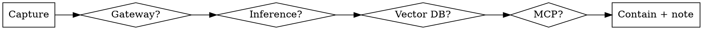

# Incident Runbook — internal AI stack (LAN)

## Overview

A structured triage path for the self-hosted stack. **Diagnose top-down through the layers before you touch anything.** The single most common cause of a wider outage is a hasty fix to the wrong layer (restarting inference when the gateway was rate-limiting). Capture first, change second.

## When to use

- Gateway 5xx / timeouts, or quota errors flooding clients.
- Inference engine slow, OOM, or refusing connections.
- RAG returns empty / irrelevant / stale answers.
- An MCP tool call hangs, errors, or returns garbage.

## Triage order (do not skip layers)

1. **Capture** the symptom verbatim: error string, status code, timestamp, which client, is it all users or one. Take this BEFORE any restart — restarts erase the evidence.
2. **Gateway** (LiteLLM / One-API): check quota/rate-limit, key validity, upstream health, recent config change. Most "the model is down" pages are gateway throttling.
3. **Inference** (vLLM / SGLang / Ollama): GPU mem (OOM?), queue depth, model loaded, KV-cache pressure. OOM under load → lower concurrency, don't just restart into the same wall.
4. **Vector DB** (Milvus / pgvector): up? index loaded? empty results often = collection not loaded or wrong `kb_id`, not a model fault.
5. **MCP** (via gateway): is the server registered and healthy? auth valid? Check the gateway's audit log for the failing call.

## Known gotchas

| Symptom | Likely cause | First move |
| --- | --- | --- |
| Sudden 429 storm | gateway quota / a client retry-loop | inspect gateway rate-limit + client backoff |
| Latency climbs then OOM | concurrency above KV-cache budget | cap max-concurrent, then scale |
| RAG answers go empty | collection not loaded / wrong `kb_id` | reload index, verify KB id |
| MCP call hangs forever | no per-call timeout at the gateway | set/confirm timeout, kill the call |
| Works for one user, not another | RBAC / key scope, not infra | check that user's gateway key + role |

## Contain, then note

- **Contain** with the smallest reversible action (shed load, fail over, lower concurrency) before any irreversible change.
- **Post-incident note** (≤10 lines): symptom, layer, root cause, fix, and the new line to add to this gotchas table. The runbook compounds — every incident makes the next one faster.

## Common mistakes

- **Restart-first.** Restarting destroys the evidence and usually fixes nothing if the cause is upstream.
- **Skipping the gateway.** It's the most common culprit and the easiest to rule out — check it first, not last.
- **No timeout on MCP calls.** A hung tool call silently consumes the whole agent; always bound it at the gateway.
- **Closing without a note.** An incident you don't write up is an incident you'll debug from scratch next quarter.
